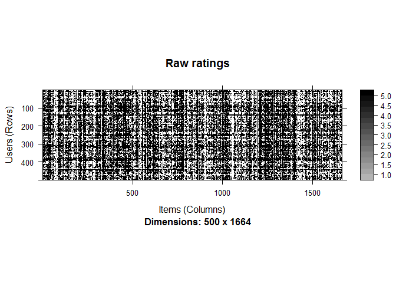
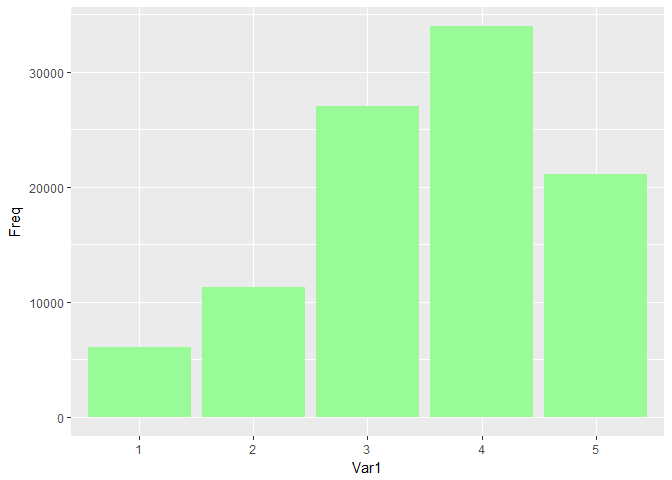
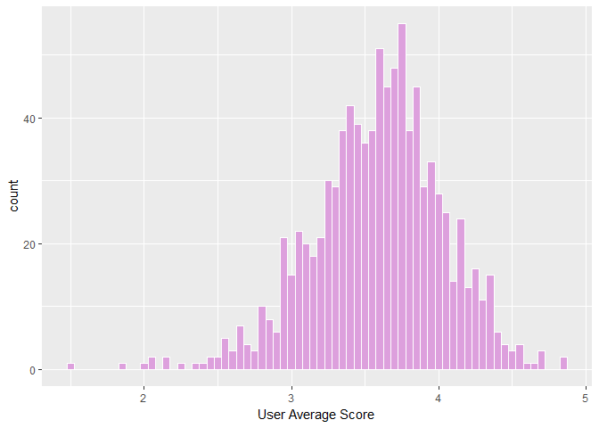
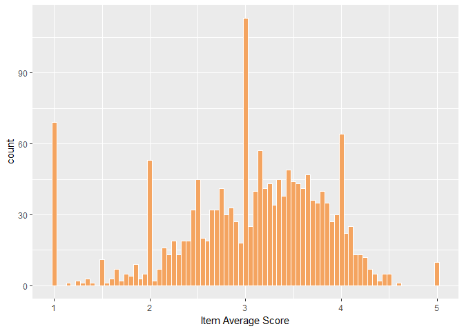
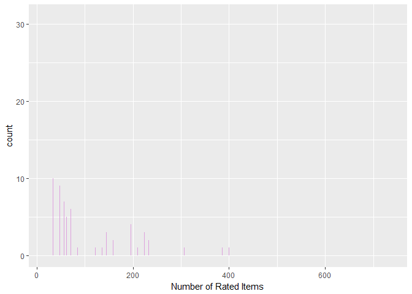
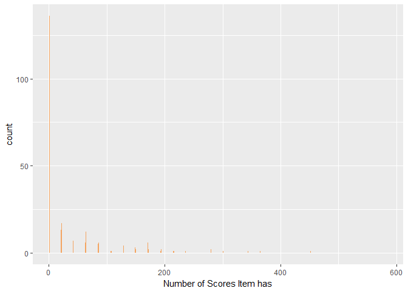
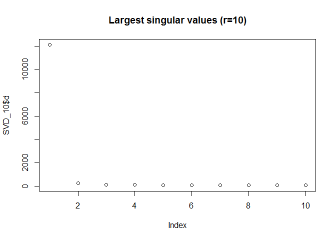
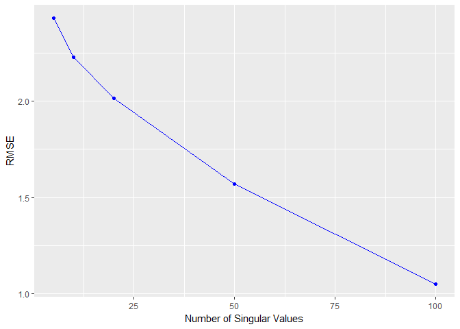

DATA643 Project 3 - Matrix Factorization Methods
================
Yun Mai, Kelly Shaffer
June 23, 2017

In this project, matrix factorization will be used for performing collaborative filtering to predict missing values of ranking matrix. SVD Approximation will be used to do laten semantic indexing. The process would be decomposeing the original ranking matrix based on Singular Value Decomposition and keeping only first r most significance entities.

``` r
install.packages("recommenderlab")
install.packages("recosystem")
install.packages("NMFN")
install.packages("Metrics")

library(devtools)
install.packages("quanteda") 
install_github(repo = "SVDApproximation", username = "tarashnot")
```

``` r
suppressWarnings(suppressMessages(library(Matrix)))
suppressWarnings(suppressMessages(library(recommenderlab)))
suppressWarnings(suppressMessages(library(irlba)))
suppressWarnings(suppressMessages(library(recosystem)))
suppressWarnings(suppressMessages(library(dplyr)))
suppressWarnings(suppressMessages(library(tidyr)))
suppressWarnings(suppressMessages(library(knitr)))

#linear algebra  here used for rmse calculation
suppressWarnings(suppressMessages(library(Metrics)))

suppressWarnings(suppressMessages(library(SlopeOne)))
suppressWarnings(suppressMessages(library(SVDApproximation)))
suppressWarnings(suppressMessages(library(NMFN)))

suppressWarnings(suppressMessages(library(data.table)))
suppressWarnings(suppressMessages(library(RColorBrewer)))

suppressWarnings(suppressMessages(library(ggplot2)))
```

#### 1. Data

``` r
data(MovieLense)
kable(head(MovieLense,n=5))
```

| user\_id | item\_id                            |  rating|
|:---------|:------------------------------------|-------:|
| 1        | 101 Dalmatians (1996)               |       2|
| 1        | 12 Angry Men (1957)                 |       5|
| 1        | 20,000 Leagues Under the Sea (1954) |       3|
| 1        | 2001: A Space Odyssey (1968)        |       4|
| 1        | Abyss, The (1989)                   |       3|

**View the raw data**

``` r
# convert ratings data to realRatingMatrix for implement of recommenderlab package
MovieLense_copy <- MovieLense 
ml <- as(MovieLense_copy,"realRatingMatrix")
image(sample(ml, 500), main = "Raw ratings")
```



``` r
rm(MovieLense_copy )
gc() #release memory
```

    ##           used (Mb) gc trigger  (Mb) max used  (Mb)
    ## Ncells 1769481 94.6    2637877 140.9  2164898 115.7
    ## Vcells 3204820 24.5    5208932  39.8  5206939  39.8

\*\*Statistics of ratings <data:**>

``` r
# add numeric movie_ID to the data
movie <- data.frame('movieID'=1, 'movie'=MovieLense[,2])
movie <- as.data.frame(table(MovieLense[,2]))
movie$movieID <- seq(1:nrow(movie))
movie <- movie[,c(3,1:2)]
colnames(movie)<- c('movieID','title','Freq')
rating <- merge(MovieLense, movie, by.x = "item_id",by.y = "title")
rating <- rating[,c(2,4,3)]
rating[,c(1,3)] <- lapply(rating[,c(1,3)],function(x) as.integer(x))

#convert to data.table
as.data.table(rating)
```

    ##        user_id movieID rating
    ##     1:     152       1      4
    ##     2:     178       1      3
    ##     3:     223       1      1
    ##     4:     299       1      2
    ##     5:     342       1      1
    ##    ---                       
    ## 99388:     463    1664      1
    ## 99389:     792    1664      3
    ## 99390:     798    1664      3
    ## 99391:      82    1664      2
    ## 99392:     881    1664      1

``` r
gc() #release memory
```

    ##           used (Mb) gc trigger  (Mb) max used  (Mb)
    ## Ncells 1771269 94.6    2637877 140.9  2164898 115.7
    ## Vcells 3055323 23.4    5208932  39.8  5208024  39.8

``` r
# visualize_ratings(ratings_table = rating) visualize_ratings function from SVDApproximation package did not work for rating but worked well for the package build-in data,ratings. So I will view the data by using ggplot2 as shown in following.
```

``` r
# use visualize_ratings function from SVDApproximation to visualize statistics for all ratings: item count of different ratings,item histogram of users' average ratings, item histogram of items' average ratings, item histogram of number of rated items by user, item histogram of number of scores items have

#distribution of ratings
rating_frq <- as.data.frame(table(rating$rating))
#distribution of rating mean of users
user_mean <- rating %>% 
  group_by(user_id) %>% 
  summarise(mean=mean(rating),number=n())
#distribution of rating mean of users
item_mean <- rating %>% 
  group_by(movieID) %>% 
  summarise(mean=mean(rating),number=n())

ggplot(rating_frq,aes(Var1,Freq)) +   
  geom_bar(aes(fill = Var1), position = "dodge", stat="identity",fill="palegreen",xlab="Score")
```

    ## Warning: Ignoring unknown parameters: xlab



``` r
par(mfrow=c(2,2))
ggplot(user_mean,aes(mean)) +
  geom_histogram(binwidth = 0.05,col='white',fill="plum") + labs(x = "User Average Score")
```



``` r
ggplot(item_mean,aes(mean)) +
  geom_histogram(binwidth = 0.05,col='white',fill="sandybrown") + labs(x = "Item Average Score")
```



``` r
ggplot(user_mean,aes(number)) +
  geom_histogram(binwidth = 0.08,fill="plum") + labs(x = "Number of Rated Items")
```



``` r
ggplot(item_mean,aes(number)) +
  geom_histogram(binwidth = 0.08,fill="sandybrown") + labs(x = "Number of Scores Item has")
```



``` r
gc() #release memory
```

    ##           used  (Mb) gc trigger  (Mb) max used  (Mb)
    ## Ncells 1909973 102.1    3205452 171.2  3205452 171.2
    ## Vcells 3643771  27.8    6330718  48.3  6329803  48.3

\*\* Normolization\*\*

Nornalized will be used for irlab package where the SVD function does not split the data into train and test data sets.

``` r
# calculate glabal mean based on train data set
global_mean <- mean(rating$rating)

# normalize the train and test data by subtracting glabal mean
rating_nor<- rating
rating_nor$rating <- rating$rating - global_mean
gc() #release memory
```

    ##           used (Mb) gc trigger  (Mb) max used  (Mb)
    ## Ncells 1819944 97.2    3205452 171.2  3205452 171.2
    ## Vcells 3337027 25.5    6330718  48.3  6329803  48.3

#### **Matrix Factorization by Singular Value Decomposition**

#### 1. Build Recommendation Model Base On SVD Method

``` r
# view the available registried mathods in recommenderlab
recommenderRegistry$get_entries()
```

    ## $ALS_realRatingMatrix
    ## Recommender method: ALS for realRatingMatrix
    ## Description: Recommender for explicit ratings based on latent factors, calculated by alternating least squares algorithm.
    ## Reference: Yunhong Zhou, Dennis Wilkinson, Robert Schreiber, Rong Pan (2008). Large-Scale Parallel Collaborative Filtering for the Netflix Prize, 4th Int'l Conf. Algorithmic Aspects in Information and Management, LNCS 5034.
    ## Parameters:
    ##   normalize lambda n_factors n_iterations min_item_nr seed
    ## 1      NULL    0.1        10           10           1 NULL
    ## 
    ## $ALS_implicit_realRatingMatrix
    ## Recommender method: ALS_implicit for realRatingMatrix
    ## Description: Recommender for implicit data based on latent factors, calculated by alternating least squares algorithm.
    ## Reference: Yifan Hu, Yehuda Koren, Chris Volinsky (2008). Collaborative Filtering for Implicit Feedback Datasets, ICDM '08 Proceedings of the 2008 Eighth IEEE International Conference on Data Mining, pages 263-272.
    ## Parameters:
    ##   lambda alpha n_factors n_iterations min_item_nr seed
    ## 1    0.1    10        10           10           1 NULL
    ## 
    ## $ALS_implicit_binaryRatingMatrix
    ## Recommender method: ALS_implicit for binaryRatingMatrix
    ## Description: Recommender for implicit data based on latent factors, calculated by alternating least squares algorithm.
    ## Reference: Yifan Hu, Yehuda Koren, Chris Volinsky (2008). Collaborative Filtering for Implicit Feedback Datasets, ICDM '08 Proceedings of the 2008 Eighth IEEE International Conference on Data Mining, pages 263-272.
    ## Parameters:
    ##   lambda alpha n_factors n_iterations min_item_nr seed
    ## 1    0.1    10        10           10           1 NULL
    ## 
    ## $AR_binaryRatingMatrix
    ## Recommender method: AR for binaryRatingMatrix
    ## Description: Recommender based on association rules.
    ## Reference: NA
    ## Parameters:
    ##   support confidence maxlen sort_measure sort_decreasing apriori_control
    ## 1     0.1        0.8      3 "confidence"            TRUE          list()
    ##   verbose
    ## 1   FALSE
    ## 
    ## $IBCF_binaryRatingMatrix
    ## Recommender method: IBCF for binaryRatingMatrix
    ## Description: Recommender based on item-based collaborative filtering (binary rating data).
    ## Reference: NA
    ## Parameters:
    ##    k    method normalize_sim_matrix alpha
    ## 1 30 "Jaccard"                FALSE   0.5
    ## 
    ## $IBCF_realRatingMatrix
    ## Recommender method: IBCF for realRatingMatrix
    ## Description: Recommender based on item-based collaborative filtering.
    ## Reference: NA
    ## Parameters:
    ##    k   method normalize normalize_sim_matrix alpha na_as_zero
    ## 1 30 "Cosine"  "center"                FALSE   0.5      FALSE
    ## 
    ## $POPULAR_binaryRatingMatrix
    ## Recommender method: POPULAR for binaryRatingMatrix
    ## Description: Recommender based on item popularity.
    ## Reference: NA
    ## Parameters: None
    ## 
    ## $POPULAR_realRatingMatrix
    ## Recommender method: POPULAR for realRatingMatrix
    ## Description: Recommender based on item popularity.
    ## Reference: NA
    ## Parameters:
    ##   normalize    aggregationRatings aggregationPopularity
    ## 1  "center" new("standardGeneric" new("standardGeneric"
    ## 
    ## $RANDOM_realRatingMatrix
    ## Recommender method: RANDOM for realRatingMatrix
    ## Description: Produce random recommendations (real ratings).
    ## Reference: NA
    ## Parameters: None
    ## 
    ## $RANDOM_binaryRatingMatrix
    ## Recommender method: RANDOM for binaryRatingMatrix
    ## Description: Produce random recommendations (binary ratings).
    ## Reference: NA
    ## Parameters: None
    ## 
    ## $RERECOMMEND_realRatingMatrix
    ## Recommender method: RERECOMMEND for realRatingMatrix
    ## Description: Re-recommends highly rated items (real ratings).
    ## Reference: NA
    ## Parameters:
    ##   randomize minRating
    ## 1         1        NA
    ## 
    ## $SVD_realRatingMatrix
    ## Recommender method: SVD for realRatingMatrix
    ## Description: Recommender based on SVD approximation with column-mean imputation.
    ## Reference: NA
    ## Parameters:
    ##    k maxiter normalize
    ## 1 10     100  "center"
    ## 
    ## $SVDF_realRatingMatrix
    ## Recommender method: SVDF for realRatingMatrix
    ## Description: Recommender based on Funk SVD with gradient descend.
    ## Reference: NA
    ## Parameters:
    ##    k gamma lambda min_epochs max_epochs min_improvement normalize verbose
    ## 1 10 0.015  0.001         50        200           1e-06  "center"   FALSE
    ## 
    ## $UBCF_binaryRatingMatrix
    ## Recommender method: UBCF for binaryRatingMatrix
    ## Description: Recommender based on user-based collaborative filtering.
    ## Reference: NA
    ## Parameters:
    ##      method nn weighted sample
    ## 1 "jaccard" 25     TRUE  FALSE
    ## 
    ## $UBCF_realRatingMatrix
    ## Recommender method: UBCF for realRatingMatrix
    ## Description: Recommender based on user-based collaborative filtering.
    ## Reference: NA
    ## Parameters:
    ##     method nn sample normalize
    ## 1 "cosine" 25  FALSE  "center"

``` r
gc() #release memory
```

    ##           used (Mb) gc trigger  (Mb) max used  (Mb)
    ## Ncells 1830248 97.8    3205452 171.2  3205452 171.2
    ## Vcells 3340885 25.5    6330718  48.3  6329803  48.3

From the list, we can see SVD (Recommender based on SVD approximation with column-mean imputation) and SVDF (Recommender based on Funk SVD with gradient descend) are available from recommenderlab package.

**1.1 SVD Modeling**

**1.1.1 Prepare Data**

``` r
# Convert the data to wide dataframe
rating_c <- as.data.frame(rating_nor)
rating_w <- spread(rating_c,movieID,rating)
rm(rating_c)

# get half of the data because of small RAM 
set.seed(124)
sample1 <- sample.int(n = nrow(rating_w), size = floor(.5*nrow(rating_w)), replace = F)
sample2 <- sample.int(n = ncol(rating_w), size = floor(.5*ncol(rating_w)), replace = F)
rating_2 <- rating_w[sample1,sample2]#
rating_3 <- cbind('user_id'=as.numeric(rownames(rating_2)),rating_2)
rating_2 <- rating_3 # raing_2 is the wide table or user-item matrix in a dataframe format

#convert data back to long table
rating_1 <- gather(rating_3,'movieID','rating',2:833)
rating_1$movieID <- as.numeric(rating_1$movieID) # raing_1 is the long table in a dataframe format
```

    ## Warning: NAs introduced by coercion

``` r
rm(rating_3)
gc() #release memory
```

    ##           used (Mb) gc trigger  (Mb) max used  (Mb)
    ## Ncells 1838001 98.2    3205452 171.2  3205452 171.2
    ## Vcells 6295017 48.1   10175559  77.7  8412821  64.2

``` r
# split the data into train set and test set
# set Seed to make sure the reproducibility of the sampling results
set.seed(125)
sample3 <- sample.int(n = nrow(rating_2), size = floor(.8*nrow(rating_2)), replace = F)
train_2 <- rating_2[sample3,] # train_1 is the wide table in a dataframe format
test_2 <- rating_2[-sample3,] # test_1 is the wide table in a dataframe format
#convert data back to long table
train_1 <- gather(train_2,'movieID','rating',2:833) # train_2 is the long table in a dataframe format
train_1$movieID<-as.numeric(train_1$movieID)
```

    ## Warning: NAs introduced by coercion

``` r
test_1 <- gather(test_2,'movieID','rating',2:833) # test_2 is the long table in a dataframe format
test_1$movieID<-as.numeric(test_1$movieID)
```

    ## Warning: NAs introduced by coercion

``` r
gc() #release memory
```

    ##           used (Mb) gc trigger  (Mb) max used  (Mb)
    ## Ncells 1839816 98.3    3205452 171.2  3205452 171.2
    ## Vcells 7669031 58.6   12290670  93.8  9018704  68.9

``` r
# find out which user and movie have been allocated into train and test set respectively
user_all <- as.list(unique(rating_2$user_id))
movie_all <- as.list(unique(rating_1$movieID))
user_train <- user_all[sample3]
movie_train <- movie_all[sample3]
user_test <- user_all[-sample3]
movie_test <- movie_all[-sample3]
gc() #release memory
```

    ##           used (Mb) gc trigger  (Mb) max used  (Mb)
    ## Ncells 1841197 98.4    3205452 171.2  3205452 171.2
    ## Vcells 7672996 58.6   12290670  93.8  9018704  68.9

``` r
# convert the data to realRatingMatrix format
rating_4 <- as.matrix(rating_2[,-1])
rating_m <- as(rating_4,"realRatingMatrix") # rating_m is the realRatingMatrix format for all data
movie_m <- getRatingMatrix(rating_m)
rm(rating_4)

train_3 <- as.matrix(train_2[,-1])
train_m <- as(train_3,"realRatingMatrix") # train_m is the realRatingMatrix format for train set
rm(train_3)

test_3 <- as.matrix(test_2[,-1])
test_m <- as(test_3,"realRatingMatrix") # train_m is the realRatingMatrix format for train set
rm(test_3)

evaluationScheme(rating_m, method="split", train=0.8, k=1, given=3)
```

    ## Evaluation scheme with 3 items given
    ## Method: 'split' with 1 run(s).
    ## Training set proportion: 0.800
    ## Good ratings: NA
    ## Data set: 471 x 832 rating matrix of class 'realRatingMatrix' with 25944 ratings.

``` r
gc() #release memory
```

    ##           used (Mb) gc trigger  (Mb) max used  (Mb)
    ## Ncells 1843435 98.5    3205452 171.2  3205452 171.2
    ## Vcells 7759178 59.2   12290670  93.8 12288859  93.8

``` r
evaluationScheme(train_m, method="split", train=0.8, k=1, given=3)
```

    ## Evaluation scheme with 3 items given
    ## Method: 'split' with 1 run(s).
    ## Training set proportion: 0.800
    ## Good ratings: NA
    ## Data set: 376 x 832 rating matrix of class 'realRatingMatrix' with 21010 ratings.

``` r
evaluationScheme(test_m, method="split", train=0.8, k=1, given=3)
```

    ## Evaluation scheme with 3 items given
    ## Method: 'split' with 1 run(s).
    ## Training set proportion: 0.800
    ## Good ratings: NA
    ## Data set: 95 x 832 rating matrix of class 'realRatingMatrix' with 4934 ratings.

``` r
gc() #release memory
```

    ##           used (Mb) gc trigger  (Mb) max used  (Mb)
    ## Ncells 1843467 98.5    3205452 171.2  3205452 171.2
    ## Vcells 7759270 59.2   12290670  93.8 12289726  93.8

**1.1.2 Get SVD**

``` r
r <- Recommender(rating_m, method = "SVD")
names(getModel(r))
```

    ## [1] "description" "svd"         "columnMeans" "k"           "maxiter"    
    ## [6] "normalize"   "verbose"

``` r
imt <- getModel(r)$svd
names(imt)
```

    ## [1] "d"     "u"     "v"     "iter"  "mprod"

``` r
print(paste("the number of latent features (k) is ",getModel(r)$k))
```

    ## [1] "the number of latent features (k) is  10"

``` r
r_train <- Recommender(train_m, method = "SVD")
imt_train <- getModel(r_train)$svd
print(paste("the number of latent features (k) for train set is ",getModel(r_train)$k))
```

    ## [1] "the number of latent features (k) for train set is  10"

``` r
r_test <- Recommender(test_m, method = "SVD")
imt_test <- getModel(r_test)$svd
print(paste("the number of latent features (k) for test setis ",getModel(r_test)$k))
```

    ## [1] "the number of latent features (k) for test setis  10"

``` r
gc() #release memory
```

    ##           used (Mb) gc trigger  (Mb) max used  (Mb)
    ## Ncells 1846835 98.7    3205452 171.2  3205452 171.2
    ## Vcells 9056058 69.1   14828804 113.2 12289726  93.8

**1.1.3 Making Predictions From the Decomposed Matrices**

Obtain SVD matrices from SVD model.By multiply U, ??, and *V*<sup>*T*</sup> back to get the rank k=10 approximation of original rating matrix.

``` r
u_sigma <- imt$u %*% diag(imt$d)
predict_rating_2 <- u_sigma %*% t(imt$v) # predict_rating_2 is the user-item version for predtion rating for all data

u_sigma_train <- imt_train$u %*% diag(imt_train$d)
predict_train_2 <- u_sigma_train %*% t(imt_train$v) # predict_train_2 is the user-item version for predtion rating for train set

predict_test_2 <- predict(r_train, test_m, verbose = TRUE,type="ratingMatrix") # predict_test_2 is the user-item version for predtion rating for test set
gc() #release memory
```

    ##           used (Mb) gc trigger  (Mb) max used  (Mb)
    ## Ncells 1846979 98.7    3205452 171.2  3205452 171.2
    ## Vcells 9888800 75.5   14828804 113.2 13391241 102.2

``` r
#u_sigma_test <- imt_test$u %*% diag(imt_test$d)
#predict_test <- u_sigma_test %*% t(imt_test$v)
```

``` r
# set the memory the process needs
memory.limit(size=40000)
```

    ## [1] 40000

``` r
# convert user-item matrix to long data frame
predict_rating <- as.data.frame(predict_rating_2)
predict_rating <- cbind('user_id'= unlist(user_all),predict_rating)
colnames(predict_rating)<- c('user_id',unlist(movie_all))
predict_all <- gather(predict_rating,movieID, rating,2:833)
predict_all$movieID <- as.numeric(predict_all$movieID)
rm(predict_rating)
gc() #release memory
```

    ##            used (Mb) gc trigger  (Mb) max used  (Mb)
    ## Ncells  1847287 98.7    3205452 171.2  3205452 171.2
    ## Vcells 11066406 84.5   17874564 136.4 13391241 102.2

``` r
kable(head(predict_all),caption = "All Prediction")
```

|  user\_id|  movieID|     rating|
|---------:|--------:|----------:|
|        79|     1466|  -6.334444|
|       386|     1466|  -6.353742|
|       485|     1466|  -6.347429|
|       374|     1466|  -6.294074|
|       210|     1466|  -6.320362|
|       275|     1466|  -6.354808|

``` r
predict_train <- as.data.frame(predict_train_2)
predict_train <- cbind('user_id'= unlist(user_train),predict_train)
colnames(predict_train)<- c('user_id',unlist(movie_all))
predict_train_1 <- gather(predict_train,movieID, rating,2:833)
rm(predict_train)
gc() #release memory
```

    ##            used (Mb) gc trigger  (Mb) max used  (Mb)
    ## Ncells  1847487 98.7    3205452 171.2  3205452 171.2
    ## Vcells 12005146 91.6   17874564 136.4 13391241 102.2

``` r
kable(head(predict_train_1),caption = "Prediction For Test set")
```

|  user\_id| movieID |     rating|
|---------:|:--------|----------:|
|       898| 1466    |  -6.250054|
|       221| 1466    |  -6.194715|
|       259| 1466    |  -6.275767|
|       236| 1466    |  -6.235077|
|       495| 1466    |  -6.214403|
|       738| 1466    |  -6.363571|

``` r
predict_test <- as.data.frame(as.matrix(getRatingMatrix(predict_test_2)))
predict_test <- cbind('user_id'= unlist(user_test),predict_test)
colnames(predict_test)<- c('user_id',unlist(movie_all))
predict_test_1 <- gather(predict_test,movieID, rating,2:833)
rm(predict_test)
gc() #release memory
```

    ##            used (Mb) gc trigger  (Mb) max used  (Mb)
    ## Ncells  1847560 98.7    3205452 171.2  3205452 171.2
    ## Vcells 12242420 93.5   17874564 136.4 13391241 102.2

``` r
kable(head(predict_test_1),caption = "Prediction For Test set")
```

|  user\_id| movieID |     rating|
|---------:|:--------|----------:|
|       210| 1466    |   3.702515|
|       262| 1466    |   2.723315|
|       721| 1466    |   8.039567|
|       799| 1466    |  80.138498|
|       381| 1466    |   5.484432|
|       690| 1466    |  11.857631|

**1.1.4 Making Recommendations**

Based on the laten index, we know the predicted ratings to all movies for every user. The movie with the high predicted ratings that a user hasn't rated will be returned.

**Predition for all data**

``` r
# find the moive user have not rated yet
predict_all[,c('movieID','rating')] <- lapply(predict_all[,c('movieID','rating')], function(x) as.numeric(x))
old_rated <- rating_1[!(is.na(rating_1$rating)),]
not_rated <- anti_join(predict_all, old_rated, by = c("user_id","movieID"))

# find the movie with high predicted ratings to recommend to users
rec_movie <- not_rated %>% 
  group_by(user_id) %>%
  arrange(desc(rating)) %>%
  filter(row_number() <= 5L) 
kable(head(rec_movie, n=6))
```

|  user\_id|  movieID|    rating|
|---------:|--------:|---------:|
|       888|     1396|  8.542856|
|       800|       84|  5.769873|
|       800|      553|  5.503101|
|       879|      553|  4.983256|
|       879|       84|  4.806627|
|       857|      581|  4.791006|

``` r
# use rmse function of Metrics to calculate RMSE for evaluation of accuracy of predictions
new_rating <- semi_join(predict_all, old_rated, by = c("user_id","movieID"))

rmse_1 <-rmse(old_rated$rating,new_rating$rating)
print(paste("RMSE of prediction for all rating is",round(rmse_1,2)))
```

    ## [1] "RMSE of prediction for all rating is 11.1"

**Predition for train set**

``` r
# find the moive user have not rated yet
predict_train_1[,c('movieID','rating')] <- lapply(predict_train_1[,c('movieID','rating')], function(x) as.numeric(x))
old_rated <- train_1[!(is.na(train_1$rating)),]
not_rated <- anti_join(predict_train_1, old_rated, by = c("user_id","movieID"))

# find the movie with high predicted ratings to recommend to users
rec_movie <- not_rated %>% 
  group_by(user_id) %>%
  arrange(desc(rating)) %>%
  filter(row_number() <= 5L) 
kable(head(rec_movie, n=6),caption = "Recommendation for train set")
```

|  user\_id|  movieID|     rating|
|---------:|--------:|----------:|
|       857|      581|  10.125103|
|       328|     1286|   4.319076|
|       888|     1396|   3.518026|
|       879|      553|   2.948613|
|       765|      553|   2.100737|
|       858|     1268|   2.003315|

``` r
# use rmse function of Metrics to calculate RMSE for evaluation of accuracy of predictions
new_rating <- semi_join(predict_train_1, old_rated, by = c("user_id","movieID"))

rmse_2 <-rmse(old_rated$rating,new_rating$rating)
print(paste("RMSE of prediction for train set is",round(rmse_2,2)))
```

    ## [1] "RMSE of prediction for train set is 10.95"

**Predition for test set**

``` r
# find the moive user have not rated yet
predict_test_1[,c('movieID','rating')] <- lapply(predict_test_1[,c('movieID','rating')], function(x) as.numeric(x))
old_rated <- test_1[!(is.na(test_1$rating)),]
not_rated <- anti_join(predict_test_1, old_rated, by = c("user_id","movieID"))

# find the movie with high predicted ratings to recommend to users
rec_movie <- not_rated %>% 
  group_by(user_id) %>%
  arrange(desc(rating)) %>%
  filter(row_number() <= 5L) 
kable(head(rec_movie, n=6),caption = "Recommendation for test set")
```

|  user\_id|  movieID|     rating|
|---------:|--------:|----------:|
|       895|       94|  120.46675|
|       895|     1323|  119.81046|
|       895|       91|  119.30338|
|       895|     1228|  119.15151|
|       895|      941|  119.10787|
|       672|      412|   99.23228|

``` r
# use rmse function of Metrics to calculate RMSE for evaluation of accuracy of predictions
new_rating <- semi_join(predict_test_1, old_rated, by = c("user_id","movieID"))

rmse_3 <-rmse(old_rated$rating,new_rating$rating)
print(paste("RMSE of prediction for test set is",round(rmse_3,2)))
```

    ## [1] "RMSE of prediction for test set is 16.34"

#### 2. Build Recommendation Model Base On Funk SVD Method

**2.1 Prepare Data**

``` r
# Convert the data to wide dataframe
rating_c <- as.data.frame(rating)
rating_w <- spread(rating_c,movieID,rating)
rm(rating_c)

# get half of the data because of small RAM 
set.seed(124)
sample1 <- sample.int(n = nrow(rating_w), size = floor(.5*nrow(rating_w)), replace = F)
sample2 <- sample.int(n = ncol(rating_w), size = floor(.5*ncol(rating_w)), replace = F)
rating_2 <- rating_w[sample1,sample2]#
rating_3 <- cbind('user_id'=as.numeric(rownames(rating_2)),rating_2)
rating_2 <- rating_3 # raing_2 is the wide table or user-item matrix in a dataframe format

#convert data back to long table
rating_1 <- gather(rating_3,'movieID','rating',2:833)
rating_1$movieID <- as.numeric(rating_1$movieID) # raing_1 is the long table in a dataframe format
```

    ## Warning: NAs introduced by coercion

``` r
rm(rating_3)
gc() #release memory
```

    ##            used (Mb) gc trigger  (Mb) max used  (Mb)
    ## Ncells  1850582 98.9    3205452 171.2  3205452 171.2
    ## Vcells 11524445 88.0   17874564 136.4 17874564 136.4

``` r
# split the data into train set and test set
# set Seed to make sure the reproducibility of the sampling results
set.seed(125)
sample3 <- sample.int(n = nrow(rating_2), size = floor(.8*nrow(rating_2)), replace = F)
train_2 <- rating_2[sample3,] # train_1 is the wide table in a dataframe format
test_2 <- rating_2[-sample3,] # test_1 is the wide table in a dataframe format
#convert data back to long table
train_1 <- gather(train_2,'movieID','rating',2:833) # train_2 is the long table in a dataframe format
train_1$movieID<-as.numeric(train_1$movieID)
```

    ## Warning: NAs introduced by coercion

``` r
test_1 <- gather(test_2,'movieID','rating',2:833) # test_2 is the long table in a dataframe format
test_1$movieID<-as.numeric(test_1$movieID)
```

    ## Warning: NAs introduced by coercion

``` r
gc() #release memory
```

    ##            used (Mb) gc trigger  (Mb) max used  (Mb)
    ## Ncells  1850688 98.9    3205452 171.2  3205452 171.2
    ## Vcells 11328443 86.5   17874564 136.4 17874564 136.4

``` r
# find out which user and movie have been allocated into train and test set respectively
user_all <- as.list(unique(rating_2$user_id))
movie_all <- as.list(unique(rating_1$movieID))
user_train <- user_all[sample3]
movie_train <- movie_all[sample3]
user_test <- user_all[-sample3]
movie_test <- movie_all[-sample3]
gc() #release memory
```

    ##            used (Mb) gc trigger  (Mb) max used  (Mb)
    ## Ncells  1850738 98.9    3205452 171.2  3205452 171.2
    ## Vcells 11328491 86.5   17874564 136.4 17874564 136.4

``` r
# convert the data to realRatingMatrix format
rating_4 <- as.matrix(rating_2[,-1])
rating_m <- as(rating_4,"realRatingMatrix") # rating_m is the realRatingMatrix format for all data
movie_m <- getRatingMatrix(rating_m)
rm(rating_4)

train_3 <- as.matrix(train_2[,-1])
train_m <- as(train_3,"realRatingMatrix") # train_m is the realRatingMatrix format for train set
rm(train_3)

test_3 <- as.matrix(test_2[,-1])
test_m <- as(test_3,"realRatingMatrix") # train_m is the realRatingMatrix format for train set
rm(test_3)

evaluationScheme(rating_m, method="split", train=0.8, k=1, given=3)
```

    ## Evaluation scheme with 3 items given
    ## Method: 'split' with 1 run(s).
    ## Training set proportion: 0.800
    ## Good ratings: NA
    ## Data set: 471 x 832 rating matrix of class 'realRatingMatrix' with 25944 ratings.

``` r
gc() #release memory
```

    ##            used (Mb) gc trigger  (Mb) max used  (Mb)
    ## Ncells  1850832 98.9    3205452 171.2  3205452 171.2
    ## Vcells 11329525 86.5   17874564 136.4 17874564 136.4

``` r
evaluationScheme(train_m, method="split", train=0.8, k=1, given=3)
```

    ## Evaluation scheme with 3 items given
    ## Method: 'split' with 1 run(s).
    ## Training set proportion: 0.800
    ## Good ratings: NA
    ## Data set: 376 x 832 rating matrix of class 'realRatingMatrix' with 21010 ratings.

``` r
evaluationScheme(test_m, method="split", train=0.8, k=1, given=3)
```

    ## Evaluation scheme with 3 items given
    ## Method: 'split' with 1 run(s).
    ## Training set proportion: 0.800
    ## Good ratings: NA
    ## Data set: 95 x 832 rating matrix of class 'realRatingMatrix' with 4934 ratings.

``` r
gc() #release memory
```

    ##            used (Mb) gc trigger  (Mb) max used  (Mb)
    ## Ncells  1850865 98.9    3205452 171.2  3205452 171.2
    ## Vcells 11329622 86.5   17874564 136.4 17874564 136.4

**2.2 Get SVD**

``` r
r <- Recommender(rating_m, method = "SVDF")
names(getModel(r))
```

    ##  [1] "description"     "svd"             "k"              
    ##  [4] "gamma"           "lambda"          "min_epochs"     
    ##  [7] "max_epochs"      "min_improvement" "normalize"      
    ## [10] "verbose"

``` r
imt <- getModel(r)$svd
names(imt)
```

    ## [1] "U"          "V"          "parameters"

``` r
print(paste("the number of latent features (k) is ",getModel(r)$k))
```

    ## [1] "the number of latent features (k) is  10"

``` r
r_train <- Recommender(train_m, method = "SVDF")
imt_train <- getModel(r_train)$svd
print(paste("the number of latent features (k) for train set is ",getModel(r_train)$k))
```

    ## [1] "the number of latent features (k) for train set is  10"

``` r
#r_test <- Recommender(test_m, method = "SVDF")
#imt_test <- getModel(r_test)$svd
#print(paste("the number of latent features (k) for test setis ",getModel(r_test)$k))
gc() #release memory
```

    ##            used (Mb) gc trigger  (Mb) max used  (Mb)
    ## Ncells  1850420 98.9    3205452 171.2  3205452 171.2
    ## Vcells 10263409 78.4   21529476 164.3 21529466 164.3

**2.3 Making Predictions From the Decomposed Matrices**

Obtain SVD matrices from SVD model.By multiply U, ??, and *V*<sup>*T*</sup> back to get the rank k=10 approximation of original rating matrix.

``` r
predict_rating_2 <- imt$U %*% t(imt$V) # predict_rating_2 is the user-item version for predtion rating for all data

predict_train_2 <- imt_train$U %*% t(imt_train$V) # predict_train_2 is the user-item version for predtion rating for train set

predict_test_2 <- predict(r_train, test_m, verbose = TRUE,type="ratingMatrix") # predict_test_2 is the user-item version for predtion rating for test set
gc() #release memory
```

    ##            used (Mb) gc trigger  (Mb) max used  (Mb)
    ## Ncells  1850704 98.9    3205452 171.2  3205452 171.2
    ## Vcells 10151874 77.5   21529476 164.3 21529466 164.3

``` r
# set the memory the process needs
memory.limit(size=40000)
```

    ## [1] 40000

``` r
# convert user-item matrix to long data frame
predict_rating <- as.data.frame(predict_rating_2)
predict_rating <- cbind('user_id'= unlist(user_all),predict_rating)
colnames(predict_rating)<- c('user_id',unlist(movie_all))
predict_all <- gather(predict_rating,movieID, rating,2:833)
predict_all$movieID <- as.numeric(predict_all$movieID)
rm(predict_rating)
gc() #release memory
```

    ##            used (Mb) gc trigger  (Mb) max used  (Mb)
    ## Ncells  1851027 98.9    3205452 171.2  3205452 171.2
    ## Vcells 10154126 77.5   21529476 164.3 21529466 164.3

``` r
kable(head(predict_all),caption = "All Prediction")
```

|  user\_id|  movieID|  rating|
|---------:|--------:|-------:|
|        79|     1466|     NaN|
|       386|     1466|     NaN|
|       485|     1466|     NaN|
|       374|     1466|     NaN|
|       210|     1466|     NaN|
|       275|     1466|     NaN|

``` r
predict_train <- as.data.frame(predict_train_2)
predict_train <- cbind('user_id'= unlist(user_train),predict_train)
colnames(predict_train)<- c('user_id',unlist(movie_all))
predict_train_1 <- gather(predict_train,movieID, rating,2:833)
rm(predict_train)
gc() #release memory
```

    ##            used (Mb) gc trigger  (Mb) max used  (Mb)
    ## Ncells  1851078 98.9    3205452 171.2  3205452 171.2
    ## Vcells 10154209 77.5   21529476 164.3 21529466 164.3

``` r
kable(head(predict_train_1),caption = "Prediction For Test set")
```

|  user\_id| movieID |  rating|
|---------:|:--------|-------:|
|       898| 1466    |     NaN|
|       221| 1466    |     NaN|
|       259| 1466    |     NaN|
|       236| 1466    |     NaN|
|       495| 1466    |     NaN|
|       738| 1466    |     NaN|

``` r
predict_test <- as.data.frame(as.matrix(getRatingMatrix(predict_test_2)))
predict_test <- cbind('user_id'= unlist(user_test),predict_test)
colnames(predict_test)<- c('user_id',unlist(movie_all))
predict_test_1 <- gather(predict_test,movieID, rating,2:833)
rm(predict_test)
gc() #release memory
```

    ##            used (Mb) gc trigger  (Mb) max used  (Mb)
    ## Ncells  1851133 98.9    3205452 171.2  3205452 171.2
    ## Vcells 10154302 77.5   21529476 164.3 21529466 164.3

``` r
kable(head(predict_test_1),caption = "Prediction For Test set")
```

|  user\_id| movieID |  rating|
|---------:|:--------|-------:|
|       210| 1466    |       0|
|       262| 1466    |       0|
|       721| 1466    |       0|
|       799| 1466    |       0|
|       381| 1466    |       0|
|       690| 1466    |       0|

**2.4 Making Recommendations**

Based on the laten index, we know the predicted ratings to all movies for every user. The movie with the high predicted ratings that a user hasn't rated will be returned.

**Predition for all data**

``` r
# find the moive user have not rated yet
predict_all[,c('movieID','rating')] <- lapply(predict_all[,c('movieID','rating')], function(x) as.numeric(x))
old_rated <- rating_1[!(is.na(rating_1$rating)),]
not_rated <- anti_join(predict_all, old_rated, by = c("user_id","movieID"))

# find the movie with high predicted ratings to recommend to users
rec_movie <- not_rated %>% 
  group_by(user_id) %>%
  arrange(desc(rating)) %>%
  filter(row_number() <= 5L) 
kable(head(rec_movie, n=6))
```

|  user\_id|  movieID|  rating|
|---------:|--------:|-------:|
|       747|     1110|     NaN|
|       843|      691|     NaN|
|       835|     1402|     NaN|
|        92|     1101|     NaN|
|       110|     1381|     NaN|
|       261|      818|     NaN|

``` r
# use rmse function of Metrics to calculate RMSE for evaluation of accuracy of predictions
new_rating <- semi_join(predict_all, old_rated, by = c("user_id","movieID"))

rmse_1 <-rmse(old_rated$rating,new_rating$rating)
print(paste("RMSE of prediction for all rating is",round(rmse_1,2)))
```

    ## [1] "RMSE of prediction for all rating is NaN"

**Predition for train set**

``` r
# find the moive user have not rated yet
predict_train_1[,c('movieID','rating')] <- lapply(predict_train_1[,c('movieID','rating')], function(x) as.numeric(x))
old_rated <- train_1[!(is.na(train_1$rating)),]
not_rated <- anti_join(predict_train_1, old_rated, by = c("user_id","movieID"))

# find the movie with high predicted ratings to recommend to users
rec_movie <- not_rated %>% 
  group_by(user_id) %>%
  arrange(desc(rating)) %>%
  filter(row_number() <= 5L) 
kable(head(rec_movie, n=6),caption = "Recommendation for train set")
```

|  user\_id|  movieID|  rating|
|---------:|--------:|-------:|
|       673|      894|     NaN|
|       292|      677|     NaN|
|       841|      399|     NaN|
|       791|     1606|     NaN|
|       795|     1084|     NaN|
|       596|      337|     NaN|

``` r
# use rmse function of Metrics to calculate RMSE for evaluation of accuracy of predictions
new_rating <- semi_join(predict_train_1, old_rated, by = c("user_id","movieID"))

rmse_2 <-rmse(old_rated$rating,new_rating$rating)
print(paste("RMSE of prediction for train set is",round(rmse_2,2)))
```

    ## [1] "RMSE of prediction for train set is NaN"

**Predition for test set**

``` r
# find the moive user have not rated yet
predict_test_1[,c('movieID','rating')] <- lapply(predict_test_1[,c('movieID','rating')], function(x) as.numeric(x))
old_rated <- test_1[!(is.na(test_1$rating)),]
not_rated <- anti_join(predict_test_1, old_rated, by = c("user_id","movieID"))

# find the movie with high predicted ratings to recommend to users
rec_movie <- not_rated %>% 
  group_by(user_id) %>%
  arrange(desc(rating)) %>%
  filter(row_number() <= 5L) 
kable(head(rec_movie, n=6),caption = "Recommendation for test set")
```

|  user\_id|  movieID|  rating|
|---------:|--------:|-------:|
|       257|      126|       0|
|       262|      961|       0|
|       272|      184|       0|
|       767|     1157|       0|
|       771|     1403|       0|
|       690|        7|       0|

``` r
# use rmse function of Metrics to calculate RMSE for evaluation of accuracy of predictions
new_rating <- semi_join(predict_test_1, old_rated, by = c("user_id","movieID"))

rmse_3 <-rmse(old_rated$rating,new_rating$rating)
print(paste("RMSE of prediction for test set is",round(rmse_3,2)))
```

    ## [1] "RMSE of prediction for test set is 18.61"

**1. In terms of RMSE, SVD based matrix decomposition performed better when the model was built on the normalized ratings instead of buidt on the original rating(data not shown).**

**2. Funk SVD is not appropreiate as it generate none predction.**

#### 3.Optimize the number of latent features (r or k) by minimizing the Root Mean Square Error (using irlba package to try different r)\*\*

``` r
#The irlba function only computes the number of singular values corresponding to the maximum of the desired singular vectors, max(nu, nv).
# max(nu, nv) must be strictly less than min(nrow(dtm), ncol(dtm)), so first see the 
max_nunv <-min(nrow(movie_m), ncol(movie_m))
print(paste("Number of left singular vectors to estimate, nu, and number of right, nv, should be less than",max_nunv,"."))
```

    ## [1] "Number of left singular vectors to estimate, nu, and number of right, nv, should be less than 471 ."

``` r
# try several r to see which one give the best prediction
SVD_5=irlba(getRatingMatrix(rating_m),nu=5,nv=5)
SVD_10=irlba(getRatingMatrix(rating_m),nu=10,nv=10)
SVD_20=irlba(getRatingMatrix(rating_m),nu=20,nv=20)
SVD_50=irlba(getRatingMatrix(rating_m),nu=50,nv=50)
SVD_100=irlba(getRatingMatrix(rating_m),nu=100,nv=100)
plot(SVD_10$d, main="Largest singular values (r=10)")
```



``` r
u_sigma <- SVD_10$u %*% diag(SVD_10$d)
predict_rating <- u_sigma %*% t(SVD_10$v)

# convert user-item matrix to long data frame
predict_rating <- as.data.frame(predict_rating)
predict_rating <- cbind('user_id'= unlist(user_all),predict_rating)
colnames(predict_rating)<- c('user_id',unlist(movie_all))
predict <- gather(predict_rating,movieID, rating,2:833)

# find the moive user have not rated yet
predict[,c('movieID','rating')] <- lapply(predict[,c('movieID','rating')], function(x) as.numeric(x))
old_rated <- rating_1[!(is.na(rating_1$rating)),]
not_rated <- anti_join(predict, old_rated, by = c("user_id","movieID"))

# find the movie with high predicted ratings to recommend to users
rec_movie <- not_rated %>% 
  group_by(user_id) %>%
  arrange(desc(rating)) %>%
  filter(row_number() <= 5L) 
kable(head(rec_movie, n=6),caption = "Recommendation for all rating")
```

|  user\_id|  movieID|    rating|
|---------:|--------:|---------:|
|       747|      629|  5.536994|
|       267|     1462|  5.393289|
|       393|       34|  5.254248|
|       451|     1502|  4.950701|
|       894|      735|  4.944022|
|       234|       84|  4.858488|

``` r
# use rmse function of Metrics to calculate RMSE for evaluation of accuracy of predictions
new_rating <- semi_join(predict, old_rated, by = c("user_id","movieID"))

rmse_4 <-rmse(old_rated$rating,new_rating$rating)
print(paste("RMSE of prediction for all rating when r=10 is",round(rmse_4,2)))
```

    ## [1] "RMSE of prediction for all rating when r=10 is 2.23"

**The RMSE derived from SVD\_10 calculated by irlba pacakge is the different from that calclated by recommenderlab. irlba use truncated SVD**

Several number of singular values(5, 20, 50, and 100) will be compared with r=10. Similar computaions will be performed as above so the code will be hide but only the results will be shown to make it consice.

``` r
u_sigma <- SVD_5$u %*% diag(SVD_5$d)
predict_rating <- u_sigma %*% t(SVD_5$v)

# convert user-item matrix to long data frame
predict_rating <- as.data.frame(predict_rating)
predict_rating <- cbind('user_id'= unlist(user_all),predict_rating)
colnames(predict_rating)<- c('user_id',unlist(movie_all))
predict <- gather(predict_rating,movieID, rating,2:833)

# find the moive user have not rated yet
predict[,c('movieID','rating')] <- lapply(predict[,c('movieID','rating')], function(x) as.numeric(x))
old_rated <- rating_1[!(is.na(rating_1$rating)),]
not_rated <- anti_join(predict, old_rated, by = c("user_id","movieID"))

# find the movie with high predicted ratings to recommend to users
rec_movie <- not_rated %>% 
  group_by(user_id) %>%
  arrange(desc(rating)) %>%
  filter(row_number() <= 5L) 
kable(head(rec_movie, n=6),caption = "Recommendation for all rating")
```

|  user\_id|  movieID|    rating|
|---------:|--------:|---------:|
|       747|      629|  5.568600|
|       788|     1400|  5.266830|
|       393|       34|  5.050835|
|       267|     1462|  4.932976|
|       907|       34|  4.924729|
|       308|      435|  4.866252|

``` r
# use rmse function of Metrics to calculate RMSE for evaluation of accuracy of predictions
new_rating <- semi_join(predict, old_rated, by = c("user_id","movieID"))

rmse_5 <-rmse(old_rated$rating,new_rating$rating)
print(paste("RMSE of prediction for all rating when r=5 is",round(rmse_5,2)))
```

    ## [1] "RMSE of prediction for all rating when r=5 is 2.43"

``` r
u_sigma <- SVD_20$u %*% diag(SVD_20$d)
predict_rating <- u_sigma %*% t(SVD_20$v)

# convert user-item matrix to long data frame
predict_rating <- as.data.frame(predict_rating)
predict_rating <- cbind('user_id'= unlist(user_all),predict_rating)
colnames(predict_rating)<- c('user_id',unlist(movie_all))
predict <- gather(predict_rating,movieID, rating,2:833)

# find the moive user have not rated yet
predict[,c('movieID','rating')] <- lapply(predict[,c('movieID','rating')], function(x) as.numeric(x))
old_rated <- rating_1[!(is.na(rating_1$rating)),]
not_rated <- anti_join(predict, old_rated, by = c("user_id","movieID"))

# find the movie with high predicted ratings to recommend to users
rec_movie <- not_rated %>% 
  group_by(user_id) %>%
  arrange(desc(rating)) %>%
  filter(row_number() <= 5L) 
kable(head(rec_movie, n=6),caption = "Recommendation for all rating")
```

|  user\_id|  movieID|    rating|
|---------:|--------:|---------:|
|       286|     1502|  5.516274|
|       267|     1462|  5.171120|
|        87|      964|  4.751248|
|       870|      615|  4.659732|
|         1|     1283|  4.601717|
|       747|      251|  4.429190|

``` r
# use rmse function of Metrics to calculate RMSE for evaluation of accuracy of predictions
new_rating <- semi_join(predict, old_rated, by = c("user_id","movieID"))

rmse_6 <-rmse(old_rated$rating,new_rating$rating)
print(paste("RMSE of prediction for all rating when r=20 is",round(rmse_6,2)))
```

    ## [1] "RMSE of prediction for all rating when r=20 is 2.01"

``` r
u_sigma <- SVD_50$u %*% diag(SVD_50$d)
predict_rating <- u_sigma %*% t(SVD_50$v)

# convert user-item matrix to long data frame
predict_rating <- as.data.frame(predict_rating)
predict_rating <- cbind('user_id'= unlist(user_all),predict_rating)
colnames(predict_rating)<- c('user_id',unlist(movie_all))
predict <- gather(predict_rating,movieID, rating,2:833)

# find the moive user have not rated yet
predict[,c('movieID','rating')] <- lapply(predict[,c('movieID','rating')], function(x) as.numeric(x))
old_rated <- rating_1[!(is.na(rating_1$rating)),]
not_rated <- anti_join(predict, old_rated, by = c("user_id","movieID"))

# find the movie with high predicted ratings to recommend to users
rec_movie <- not_rated %>% 
  group_by(user_id) %>%
  arrange(desc(rating)) %>%
  filter(row_number() <= 5L) 
kable(head(rec_movie, n=6),caption = "Recommendation for all rating")
```

|  user\_id|  movieID|    rating|
|---------:|--------:|---------:|
|        87|      998|  3.848015|
|       296|      853|  3.730246|
|       901|      556|  3.568451|
|         1|      867|  3.548883|
|       286|     1469|  3.491770|
|       763|     1283|  3.445356|

``` r
# use rmse function of Metrics to calculate RMSE for evaluation of accuracy of predictions
new_rating <- semi_join(predict, old_rated, by = c("user_id","movieID"))

rmse_7 <-rmse(old_rated$rating,new_rating$rating)
print(paste("RMSE of prediction for all rating when r=50 is",round(rmse_7,2)))
```

    ## [1] "RMSE of prediction for all rating when r=50 is 1.57"

``` r
u_sigma <- SVD_100$u %*% diag(SVD_100$d)
predict_rating <- u_sigma %*% t(SVD_100$v)

# convert user-item matrix to long data frame
predict_rating <- as.data.frame(predict_rating)
predict_rating <- cbind('user_id'= unlist(user_all),predict_rating)
colnames(predict_rating)<- c('user_id',unlist(movie_all))
predict <- gather(predict_rating,movieID, rating,2:833)

# find the moive user have not rated yet
predict[,c('movieID','rating')] <- lapply(predict[,c('movieID','rating')], function(x) as.numeric(x))
old_rated <- rating_1[!(is.na(rating_1$rating)),]
not_rated <- anti_join(predict, old_rated, by = c("user_id","movieID"))

# find the movie with high predicted ratings to recommend to users
rec_movie <- not_rated %>% 
  group_by(user_id) %>%
  arrange(desc(rating)) %>%
  filter(row_number() <= 5L) 
kable(head(rec_movie, n=6),caption = "Recommendation for all rating")
```

|  user\_id|  movieID|    rating|
|---------:|--------:|---------:|
|       221|     1561|  2.438817|
|       899|      556|  2.387084|
|       480|      304|  2.365657|
|       458|      717|  2.357985|
|       752|       45|  2.286522|
|       593|      519|  2.262665|

``` r
# use rmse function of Metrics to calculate RMSE for evaluation of accuracy of predictions
new_rating <- semi_join(predict, old_rated, by = c("user_id","movieID"))

rmse_8 <-rmse(old_rated$rating,new_rating$rating)
print(paste("RMSE of prediction for all rating when r=100 is",round(rmse_8,2)))
```

    ## [1] "RMSE of prediction for all rating when r=100 is 1.05"

``` r
kable(RMSE <- data.frame('r'=c(5,10,20,50,100),'RMSE'=c(rmse_5,rmse_4,rmse_6,rmse_7,rmse_8)))
```

|    r|      RMSE|
|----:|---------:|
|    5|  2.429501|
|   10|  2.226535|
|   20|  2.014206|
|   50|  1.570207|
|  100|  1.050868|

``` r
ggplot(RMSE,aes(r,RMSE))+
  geom_line(col='blue')+geom_point(col='blue')+labs(x="Number of Singular Values",y="RMSE")
```



**The RMSE decreased as the number of singular values increase, suggesting that SVD approximation get closer to real rating as we increased the latent features.**
