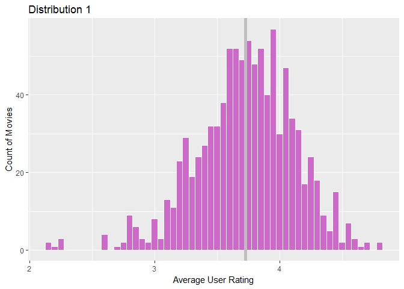

DATA643 Project4: Accuracy and Beyond
================
Kelly Shaffer, Yun Mai
June 29, 2017

#### In this project, the accuracy of five recommender system algorithms will be compared against the offline data.

#### Serendipity will be introduced to the user-based collaborative filtering model to improve the user experience.

**Load packages**

``` r
#convert to data to spase matrix
suppressWarnings(suppressMessages(library(Matrix)))
#recommedation model building
suppressWarnings(suppressMessages(library(recommenderlab)))
#data manipulation
suppressWarnings(suppressMessages(library(dplyr)))
suppressWarnings(suppressMessages(library(tidyr)))
suppressWarnings(suppressMessages(library(stringr)))
suppressWarnings(suppressMessages(library(knitr)))
# similarity calculation
suppressWarnings(suppressMessages(library(proxy)))
#linear algebra  here used for rmse calculation
suppressWarnings(suppressMessages(library(Metrics)))
#visualizations
suppressWarnings(suppressMessages(library(ggplot2)))
```

### 1. Load the data

``` r
data(MovieLense)
```

### 2. Explore the data

#### 2.1 Distribution of ratings

``` r
#distribution of ratings
vector_ratings <- as.vector(MovieLense@data)
(rating_frq <- table(vector_ratings))
```

    ## vector_ratings
    ##       0       1       2       3       4       5 
    ## 1469760    6059   11307   27002   33947   21077

``` r
qplot(vector_ratings) + ggtitle("Distribution of the ratings") + labs(x = "Score")
```

    ## `stat_bin()` using `bins = 30`. Pick better value with `binwidth`.


There are a lot of missing values(0). The most common rating is 4.

#### 2.2 Select the most relevant data

``` r
#selece only the users who have rated at least 50 movies and movies that had been rated more than 100 times
(ratings_movies <- MovieLense[rowCounts(MovieLense) > 50,
colCounts(MovieLense) > 100])
```

    ## 560 x 332 rating matrix of class 'realRatingMatrix' with 55298 ratings.

#### 2.3 Distribution of user rating mean and items and distribution of number of rated items and number of ratings a item has

``` r
#convert the data to realRatingMatrix
ml <- as(MovieLense@data, "realRatingMatrix")

#distribution of user rating means
user_summary <-  as.data.frame(cbind('mean'=rowMeans(ratings_movies),'number'=rowCounts(ml)))
```

    ## Warning in cbind(mean = rowMeans(ratings_movies), number = rowCounts(ml)):
    ## number of rows of result is not a multiple of vector length (arg 1)

``` r
user_summary <-as.data.frame(sapply(user_summary, function(x) as.numeric(as.character(x))))

#distribution of movie rating means
item_summary <- as.data.frame(cbind('mean'=colMeans(ml), 'number'=colCounts(ratings_movies)))
```

    ## Warning in cbind(mean = colMeans(ml), number = colCounts(ratings_movies)):
    ## number of rows of result is not a multiple of vector length (arg 2)

``` r
item_summary <-as.data.frame(sapply(item_summary, function(x) as.numeric(as.character(x))))

par(mfrow=c(1,2))

#distribution 1
ggplot(user_summary,aes(mean)) +
  geom_histogram(binwidth = 0.05,col='white',fill="orchid3") + labs(x = "Average User Rating", y = "Count of Movies", title = "Distribution 1") + geom_vline(xintercept = mean(user_summary$mean),col='grey',size=2)
```



``` r
#distribution 2
ggplot(item_summary,aes(mean)) +
  geom_histogram(binwidth = 0.05,col='white',fill="seagreen3") + labs(x = "Average Movie Rating", y = "Count of Movies", title = "Distribution 2") + geom_vline(xintercept = mean(item_summary$mean),col='grey',size=2)
```


``` r
#distribution 3 
ggplot(user_summary,aes(number)) +
  geom_histogram(binwidth = 0.8,fill="violetred2") + labs(x = "Count of Rated Items", y = "Count of Users", title = "Distribution 3")
```


``` r
#distribution 4
ggplot(item_summary,aes(number)) +
  geom_histogram(binwidth = 0.8,fill="turquoise2") + labs(x = "Count of Ratings per Movie", y = "Count of Movies", title = "Distribution 4")
```


**From the figures, we can see:**

**1) Distribution 1 contains the rating means of users and distribution 2 contains the rating means of movies. We can see that the distributions are normal with a grey line indicating the mean.**

**2) Distribution 3 contains the number of movies rated by each user. Distribution 4 contains the number of times each movie was rated. We can see that both distributions are right skewed, suggesting that many movies have been rated by only a few users.**

**The movies which have been rated less than 100 times will be removed for our analysis going forward.**

### 2.4 Viewing the matrix by building a heat map whose colors represent the ratings

``` r
image(ratings_movies, main = "Heatmap of the rating matrix")
```


``` r
# select the top users and movies
top_movies <- quantile(rowCounts(ratings_movies), 0.98)
top_users <- quantile(colCounts(ratings_movies), 0.98)

#heatmap of the top users and movies
image(ratings_movies[rowCounts(ratings_movies) > top_movies,
colCounts(ratings_movies) > top_users], main = "Heatmap of the top
users and movies")
```


### 3.Normalizing the data

``` r
ratings_movies_nor <- normalize(ratings_movies)
getRatingMatrix(ratings_movies_nor)[1:5,1:5]
```

    ## 5 x 5 sparse Matrix of class "dgCMatrix"
    ##   Toy Story (1995) GoldenEye (1995) Get Shorty (1995)
    ## 1       1.17341040       -0.8265896        -0.8265896
    ## 2       0.07317073        .                 .        
    ## 3       .                 .                 .        
    ## 5       0.71739130       -0.2826087         .        
    ## 6       0.38194444        .                 .        
    ##   Twelve Monkeys (1995) Babe (1995)
    ## 1             0.1734104  -2.8265896
    ## 2             .           .        
    ## 3             .           .        
    ## 5             .           .        
    ## 6            -1.6180556   0.3819444

### 4. Binarizing the data

``` r
(mean(getRatingMatrix(ratings_movies),na.rm=TRUE))
```

    ## [1] 1.102705

``` r
ratings_movies_bi <- binarize(ratings_movies, minRating = 1)
getRatingMatrix(ratings_movies_bi)
```

    ## itemMatrix in sparse format with
    ##  560 rows (elements/transactions) and
    ##  332 columns (items)

### 5. Comparing models

#### 5.1 Evaluating the recommendations

``` r
# use the minimum number of items purchased by any user tp decide item number to keep
(min(rowCounts(ratings_movies)))
```

    ## [1] 18

``` r
n_fold <- 4
items_to_keep <- 15
rating_threshold <- 3

# Use k-fold to validate models
eval_sets <- evaluationScheme(data = ratings_movies, method = "cross-validation",k = n_fold, given = items_to_keep, goodRating = rating_threshold)

models  <- list(
  RANDOM = list(name = "RANDOM", param = NULL),
  POPULAR = list(name = "POPULAR", param = NULL),
  IBCF=list(name="IBCF",param=list(method = "cosine")),
  UBCF=list(name="UBCF", param=list(method = "cosine")),
  SVD=list(name="SVD", param=list(k =100))
)

# varying the number of items we want to recommend to users
n_rec <- c(1, 5, seq(10, 100, 10))

# evaluating the recommendations
results <- evaluate(x = eval_sets, method = models, n= n_rec)
```

    ## RANDOM run fold/sample [model time/prediction time]
    ##   1  [0sec/0.09sec] 
    ##   2  [0sec/0.08sec] 
    ##   3  [0sec/0.08sec] 
    ##   4  [0sec/0.09sec] 
    ## POPULAR run fold/sample [model time/prediction time]
    ##   1  [0.02sec/0.28sec] 
    ##   2  [0sec/0.33sec] 
    ##   3  [0sec/0.3sec] 
    ##   4  [0sec/0.28sec] 
    ## IBCF run fold/sample [model time/prediction time]
    ##   1  [0.3sec/0.09sec] 
    ##   2  [0.32sec/0.06sec] 
    ##   3  [0.28sec/0.07sec] 
    ##   4  [0.3sec/0.06sec] 
    ## UBCF run fold/sample [model time/prediction time]
    ##   1  [0sec/0.3sec] 
    ##   2  [0.01sec/0.3sec] 
    ##   3  [0.01sec/0.28sec] 
    ##   4  [0sec/0.32sec] 
    ## SVD run fold/sample [model time/prediction time]
    ##   1  [0.41sec/0.09sec] 
    ##   2  [0.43sec/0.08sec] 
    ##   3  [0.43sec/0.08sec] 
    ##   4  [0.42sec/0.09sec]

``` r
# extract the related average confusion matrices
(avg_matrices <- lapply(results, avg))
```

    ## $RANDOM
    ##             TP         FP       FN       TN precision      recall
    ## 1    0.2928571  0.7071429 72.78929 243.2107 0.2928571 0.004270575
    ## 5    1.3553571  3.6446429 71.72679 240.2732 0.2710714 0.017964606
    ## 10   2.6892857  7.3107143 70.39286 236.6071 0.2689286 0.035654372
    ## 20   5.1053571 14.8946429 67.97679 229.0232 0.2552679 0.069219379
    ## 30   7.4125000 22.5875000 65.66964 221.3304 0.2470833 0.102476189
    ## 40   9.5142857 30.4857143 63.56786 213.4321 0.2378571 0.130939870
    ## 50  11.8232143 38.1767857 61.25893 205.7411 0.2364643 0.162685210
    ## 60  14.1232143 45.8767857 58.95893 198.0411 0.2353869 0.194105941
    ## 70  16.4160714 53.5839286 56.66607 190.3339 0.2345153 0.224957168
    ## 80  18.7392857 61.2607143 54.34286 182.6571 0.2342411 0.257014862
    ## 90  21.0142857 68.9857143 52.06786 174.9321 0.2334921 0.288600537
    ## 100 23.3535714 76.6464286 49.72857 167.2714 0.2335357 0.321165926
    ##             TPR         FPR
    ## 1   0.004270575 0.002866124
    ## 5   0.017964606 0.014716559
    ## 10  0.035654372 0.029575461
    ## 20  0.069219379 0.060693494
    ## 30  0.102476189 0.092334790
    ## 40  0.130939870 0.124869245
    ## 50  0.162685210 0.156351691
    ## 60  0.194105941 0.188014393
    ## 70  0.224957168 0.219613180
    ## 80  0.257014862 0.251060769
    ## 90  0.288600537 0.282869278
    ## 100 0.321165926 0.314216195
    ## 
    ## $POPULAR
    ##             TP         FP       FN       TN precision     recall
    ## 1    0.7071429  0.2928571 72.37500 243.6250 0.7071429 0.01145303
    ## 5    2.8196429  2.1803571 70.26250 241.7375 0.5639286 0.04331622
    ## 10   5.1285714  4.8714286 67.95357 239.0464 0.5128571 0.07596419
    ## 20   9.1910714 10.8089286 63.89107 233.1089 0.4595536 0.13223529
    ## 30  12.1571429 17.8428571 60.92500 226.0750 0.4052381 0.17382193
    ## 40  15.2785714 24.7214286 57.80357 219.1964 0.3819643 0.21601789
    ## 50  17.9928571 32.0071429 55.08929 211.9107 0.3598571 0.25202755
    ## 60  20.8910714 39.1089286 52.19107 204.8089 0.3481845 0.29113854
    ## 70  23.6107143 46.3892857 49.47143 197.5286 0.3372959 0.32846169
    ## 80  26.1767857 53.8232143 46.90536 190.0946 0.3272098 0.36406852
    ## 90  28.8053571 61.1946429 44.27679 182.7232 0.3200595 0.39884662
    ## 100 31.1339286 68.8660714 41.94821 175.0518 0.3113393 0.42826986
    ##            TPR         FPR
    ## 1   0.01145303 0.001080851
    ## 5   0.04331622 0.008316530
    ## 10  0.07596419 0.018762528
    ## 20  0.13223529 0.042113779
    ## 30  0.17382193 0.070554571
    ## 40  0.21601789 0.098276733
    ## 50  0.25202755 0.127853844
    ## 60  0.29113854 0.156593706
    ## 70  0.32846169 0.186223198
    ## 80  0.36406852 0.216569291
    ## 90  0.39884662 0.246531870
    ## 100 0.42826986 0.277784072
    ## 
    ## $IBCF
    ##             TP         FP       FN       TN precision      recall
    ## 1    0.3357143  0.6642857 72.74643 243.2536 0.3357143 0.004374705
    ## 5    1.4053571  3.5946429 71.67679 240.3232 0.2810714 0.017999937
    ## 10   2.7750000  7.2250000 70.30714 236.6929 0.2775000 0.036471158
    ## 20   5.4500000 14.5500000 67.63214 229.3679 0.2725000 0.073349342
    ## 30   7.9339286 22.0660714 65.14821 221.8518 0.2644643 0.108292290
    ## 40  10.4017857 29.5982143 62.68036 214.3196 0.2600446 0.143868963
    ## 50  12.8982143 37.1017857 60.18393 206.8161 0.2579643 0.179511024
    ## 60  15.4035714 44.5964286 57.67857 199.3214 0.2567262 0.215981462
    ## 70  17.8446429 52.1446429 55.23750 191.7732 0.2549426 0.250424540
    ## 80  20.4928571 59.4785714 52.58929 184.4393 0.2562054 0.289873412
    ## 90  23.0410714 66.9125000 50.04107 177.0054 0.2560764 0.326827816
    ## 100 25.5678571 74.3642857 47.51429 169.5536 0.2557640 0.362906327
    ##             TPR         FPR
    ## 1   0.004374705 0.002644747
    ## 5   0.017999937 0.014543436
    ## 10  0.036471158 0.029241205
    ## 20  0.073349342 0.059009646
    ## 30  0.108292290 0.089751844
    ## 40  0.143868963 0.120635927
    ## 50  0.179511024 0.151310015
    ## 60  0.215981462 0.182076772
    ## 70  0.250424540 0.213032916
    ## 80  0.289873412 0.242936437
    ## 90  0.326827816 0.273261863
    ## 100 0.362906327 0.303729447
    ## 
    ## $UBCF
    ##             TP         FP       FN       TN precision     recall
    ## 1    0.7017857  0.2982143 72.38036 243.6196 0.7017857 0.01220827
    ## 5    2.8857143  2.1142857 70.19643 241.8036 0.5771429 0.04702346
    ## 10   5.2571429  4.7428571 67.82500 239.1750 0.5257143 0.08328652
    ## 20   9.2089286 10.7910714 63.87321 233.1268 0.4604464 0.14066914
    ## 30  12.6321429 17.3678571 60.45000 226.5500 0.4210714 0.18840804
    ## 40  15.8053571 24.1946429 57.27679 219.7232 0.3951339 0.23202483
    ## 50  18.7375000 31.2625000 54.34464 212.6554 0.3747500 0.27271392
    ## 60  21.4321429 38.5678571 51.65000 205.3500 0.3572024 0.30721739
    ## 70  24.0125000 45.9875000 49.06964 197.9304 0.3430357 0.34128681
    ## 80  26.5160714 53.4839286 46.56607 190.4339 0.3314509 0.37526323
    ## 90  28.8357143 61.1642857 44.24643 182.7536 0.3203968 0.40541830
    ## 100 31.0285714 68.9714286 42.05357 174.9464 0.3102857 0.43427811
    ##            TPR         FPR
    ## 1   0.01220827 0.001126196
    ## 5   0.04702346 0.008107608
    ## 10  0.08328652 0.018392733
    ## 20  0.14066914 0.042441102
    ## 30  0.18840804 0.068782484
    ## 40  0.23202483 0.096263592
    ## 50  0.27271392 0.124867031
    ## 60  0.30721739 0.154503893
    ## 70  0.34128681 0.184623029
    ## 80  0.37526323 0.215195928
    ## 90  0.40541830 0.246545343
    ## 100 0.43427811 0.278553790
    ## 
    ## $SVD
    ##             TP         FP       FN       TN precision      recall
    ## 1    0.4232143  0.5767857 72.65893 243.3411 0.4232143 0.007227402
    ## 5    1.8642857  3.1357143 71.21786 240.7821 0.3728571 0.028840406
    ## 10   3.4285714  6.5714286 69.65357 237.3464 0.3428571 0.051045546
    ## 20   6.2946429 13.7053571 66.78750 230.2125 0.3147321 0.091319430
    ## 30   9.0071429 20.9928571 64.07500 222.9250 0.3002381 0.129605418
    ## 40  11.6767857 28.3232143 61.40536 215.5946 0.2919196 0.167486628
    ## 50  14.1517857 35.8482143 58.93036 208.0696 0.2830357 0.201127430
    ## 60  16.5964286 43.4035714 56.48571 200.5143 0.2766071 0.235533120
    ## 70  18.8678571 51.1321429 54.21429 192.7857 0.2695408 0.267006636
    ## 80  21.1982143 58.8017857 51.88393 185.1161 0.2649777 0.298139049
    ## 90  23.4732143 66.5267857 49.60893 177.3911 0.2608135 0.328709313
    ## 100 25.6428571 74.3571429 47.43929 169.5607 0.2564286 0.358822133
    ##             TPR         FPR
    ## 1   0.007227402 0.002302426
    ## 5   0.028840406 0.012652990
    ## 10  0.051045546 0.026485003
    ## 20  0.091319430 0.055412786
    ## 30  0.129605418 0.085049791
    ## 40  0.167486628 0.114944979
    ## 50  0.201127430 0.145716168
    ## 60  0.235533120 0.176677693
    ## 70  0.267006636 0.208370772
    ## 80  0.298139049 0.239896561
    ## 90  0.328709313 0.271505855
    ## 100 0.358822133 0.303776359

#### To interpret these results, this key may be helpful:

. True Positives (TP): These are recommended items that have been rated

. False Positives (FP): These are recommended items that haven't been rated . False Negatives(FN): These are not recommended items that have been rated

. True Negatives (TN): These are not recommended items that haven't been rated

. True Positive Rate (TPR): This is the percentage of purchased items that have been recommended. It's the number of TP divided by the number of purchased items (TP + FN).

. False Positive Rate (FPR): This is the percentage of not purchased items that have been recommended. It's the number of FP divided by the number of not purchased items (FP + TN).

#### 5.2 Evaluating the ratings

``` r
recommender_random <- Recommender(data = getData(eval_sets, "train"),
method = "RANDOM",parameter = NULL)

recommender_popular <- Recommender(data = getData(eval_sets, "train"),
method = "POPULAR",parameter = NULL)

recommender_ibcf <- Recommender(data = getData(eval_sets, "train"),
method = "IBCF",parameter = list(method = "cosine"))

recommender_ubcf <- Recommender(data = getData(eval_sets, "train"),
method = "UBCF",parameter = list(method = "cosine"))

recommender_svd <- Recommender(data = getData(eval_sets, "train"),
method = "SVD",parameter = list(k =100))

items_to_recommend <- 10

eval_prediction_random <- predict(object = recommender_random, newdata =
getData(eval_sets, "known"), n = items_to_recommend, type = "ratings")

eval_prediction_popular <- predict(object = recommender_popular, newdata = getData(eval_sets, "known"), n = items_to_recommend, type = "ratings")

eval_prediction_ibcf <- predict(object = recommender_ibcf, newdata = getData(eval_sets, "known"), n = items_to_recommend, type = "ratings")

eval_prediction_ubcf <- predict(object = recommender_ubcf, newdata = getData(eval_sets, "known"), n = items_to_recommend, type = "ratings")

eval_prediction_svd <- predict(object = recommender_svd, newdata = getData(eval_sets, "known"), n = items_to_recommend, type = "ratings")

# compare RMSE for different models
######################RANDOM######################
eval_accuracy_random <- calcPredictionAccuracy(
x = eval_prediction_random, data = getData(eval_sets, "unknown"), byUser = F)

eval_accuracy_random_user <- calcPredictionAccuracy(
x = eval_prediction_random, data = getData(eval_sets, "unknown"), byUser = TRUE)

head(eval_accuracy_random_user)
```

    ##           RMSE       MSE       MAE
    ## [1,] 1.0379641 1.0773694 0.8187793
    ## [2,] 1.8527226 3.4325810 1.5620536
    ## [3,] 1.4057052 1.9760071 1.1328627
    ## [4,] 1.0524699 1.1076930 0.8254285
    ## [5,] 1.5013155 2.2539482 1.2322209
    ## [6,] 0.7466067 0.5574215 0.5738932

``` r
qplot(eval_accuracy_random_user[, "RMSE"]) + geom_histogram(binwidth = 0.05) + ggtitle("Distribution of the Random RMSE by user")
```

    ## `stat_bin()` using `bins = 30`. Pick better value with `binwidth`.


``` r
######################POPULAR######################
eval_accuracy_popular <- calcPredictionAccuracy(
x = eval_prediction_popular, data = getData(eval_sets, "unknown"), byUser =F) 

eval_accuracy_popular_user <- calcPredictionAccuracy(
x = eval_prediction_popular, data = getData(eval_sets, "unknown"), byUser = TRUE)

head(eval_accuracy_popular_user)
```

    ##         RMSE       MSE       MAE
    ## 2  0.8218942 0.6755100 0.5308608
    ## 5  1.1608708 1.3476211 0.9514454
    ## 37 0.7611009 0.5792745 0.6069919
    ## 41 0.9765247 0.9536005 0.7844416
    ## 48 0.9446008 0.8922708 0.7510001
    ## 52 0.6072976 0.3688104 0.5032023

``` r
qplot(eval_accuracy_popular_user[, "RMSE"]) + geom_histogram(binwidth = 0.05) + ggtitle("Distribution of the Popular RMSE by user")
```

    ## `stat_bin()` using `bins = 30`. Pick better value with `binwidth`.


``` r
######################IBCF######################
eval_accuracy_ibcf <- calcPredictionAccuracy(
x = eval_prediction_ibcf, data = getData(eval_sets, "unknown"), byUser = F)

eval_accuracy_ibcf_user <- calcPredictionAccuracy(
x = eval_prediction_ibcf, data = getData(eval_sets, "unknown"), byUser = TRUE)

head(eval_accuracy_ibcf_user)
```

    ##         RMSE       MSE       MAE
    ## 2  0.9685839 0.9381549 0.7218720
    ## 5  1.6425842 2.6980829 1.3166811
    ## 37 1.1849749 1.4041656 0.9173770
    ## 41 1.1542880 1.3323807 0.8261993
    ## 48 1.3735792 1.8867198 1.0405919
    ## 52 0.8521626 0.7261811 0.5555440

``` r
qplot(eval_accuracy_ibcf_user[, "RMSE"]) + geom_histogram(binwidth = 0.05) + ggtitle("Distribution of the IBCF RMSE by user")
```

    ## `stat_bin()` using `bins = 30`. Pick better value with `binwidth`.


``` r
######################UBCF######################
eval_accuracy_ubcf <- calcPredictionAccuracy(
x = eval_prediction_ubcf, data = getData(eval_sets, "unknown"), byUser = F)

eval_accuracy_ubcf_user <- calcPredictionAccuracy(
x = eval_prediction_ubcf, data = getData(eval_sets, "unknown"), byUser = TRUE)

head(eval_accuracy_ubcf_user)
```

    ##         RMSE       MSE       MAE
    ## 2  0.8707229 0.7581584 0.6126365
    ## 5  1.1990919 1.4378213 0.9617510
    ## 37 0.7519982 0.5655013 0.5963140
    ## 41 0.9074501 0.8234656 0.6667928
    ## 48 1.0294677 1.0598037 0.8117922
    ## 52 0.7183747 0.5160621 0.5635220

``` r
qplot(eval_accuracy_ubcf_user[, "RMSE"]) + geom_histogram(binwidth = 0.05) + ggtitle("Distribution of the IBCF RMSE by user")
```

    ## `stat_bin()` using `bins = 30`. Pick better value with `binwidth`.


``` r
######################SVD######################
eval_accuracy_svd <- calcPredictionAccuracy(
x = eval_prediction_svd, data = getData(eval_sets, "unknown"), byUser = F)

eval_accuracy_svd_user <- calcPredictionAccuracy(
x = eval_prediction_svd, data = getData(eval_sets, "unknown"), byUser = TRUE)

head(eval_accuracy_svd_user)
```

    ##         RMSE       MSE       MAE
    ## 2  0.9123693 0.8324178 0.6613346
    ## 5  1.2643788 1.5986537 1.0271969
    ## 37 0.8721030 0.7605636 0.6966029
    ## 41 0.9459423 0.8948068 0.6606074
    ## 48 1.0593662 1.1222568 0.8383790
    ## 52 0.7587118 0.5756436 0.5982028

``` r
qplot(eval_accuracy_svd_user[, "RMSE"]) + geom_histogram(binwidth = 0.05) + ggtitle("Distribution of the IBCF RMSE by user")
```

    ## `stat_bin()` using `bins = 30`. Pick better value with `binwidth`.


``` r
kable(RMSE_COMPARE <- rbind(eval_accuracy_random,eval_accuracy_popular,eval_accuracy_ibcf,eval_accuracy_ubcf,eval_accuracy_svd))
```

|                         |       RMSE|        MSE|        MAE|
|-------------------------|----------:|----------:|----------:|
| eval\_accuracy\_random  |  1.3693427|  1.8750994|  1.0699836|
| eval\_accuracy\_popular |  0.9703374|  0.9415546|  0.7659031|
| eval\_accuracy\_ibcf    |  1.2377678|  1.5320691|  0.9191092|
| eval\_accuracy\_ubcf    |  0.9930281|  0.9861048|  0.7889459|
| eval\_accuracy\_svd     |  1.0273558|  1.0554600|  0.8240970|

``` r
RMSE_COMPARE <- as.data.frame(RMSE_COMPARE)
RMSE_COMPARE$model <- c('Random','Popular','IBCF','UBCF','SVD')

ggplot(RMSE_COMPARE, aes(model,RMSE))+ geom_point(colour = "blue", size = 3)
```


#### Above, we chose to look at the RMSE scores both with by user and not by user mostly for demonstration purposes. You can see that by user, the RMSE values don't give us the information we need. We want to look at the performance of the entire model, not the performance of the model for each individual. Therefore, using byUser = FALSE is the recommended approach.

#### We can see that the popular recommender is our best performer, with user-based collaborative filtering coming in second place, and singular value decomposition coming in third.

------------------------------------------------------------------------

Serendipity, novelty, and diversity
-----------------------------------

#### If we want to go beyond accuracy of a model, we can start looking at measures such as serendipity, novelty, and diversity. There is a lot of research out there now stating that an accurate model is not necessarily a good one, particularly if the recommendations aren't useful to the user.

#### In the case of serendipity, a formal definition hasn't been created but we can think of it as the model predicting something unexpected and useful that the user was not specifically searching for. This does not necessarily improve the accuracy of the model, but it improves the quality of the predictions the model makes.

#### Novelty is a metric rooted in popularity. In our case, if a movie is very popular, there's a good chance a lot of our users have seen it. In the case of a recommendation system, we would want to decrease the weight of these popular shows and increase the weight of shows that are less popular but similar to the movies the user has watched before.

#### Diversity is our final metric, based on keeping recommendations fresh for the user. Users like new recommendations, and are going to get bored with the same ones over and over. One way to implement this in a recommender system would be to shuffle the top recommendations. That way, they're still relevant, but the user isn't seeing the same recommendations over and over.

### 6.Serendipity

#### 6.1 Build a modle by combinding user-based and genre\_based method

``` r
# convert data to realRatingMatrix format
mls <- as(ratings_movies,"realRatingMatrix")

items_genre_all <- MovieLenseMeta[,-c(2,3,4)]
items_genre_movie <- semi_join(data.frame('title'=colnames(ratings_movies)), items_genre_all, by = "title")
items_genre <- semi_join(items_genre_all, items_genre_movie, by = "title")

rating_m <- as.matrix(getRatingMatrix(ratings_movies))

# number of user, genre, and movie
nuser <- length(rating_m[,1])
ngenre <- length(items_genre[1,])-1
nmovie <- length(items_genre[,1])

# Compute average rating of each genre for a given user
user_genre <- data.frame(matrix(0, nrow = nuser, ncol = ngenre))

for (i in 1:nuser){
  for(j in 1:ngenre){
    v1 <- as.matrix(rating_m[i,])
    v2 <- as.matrix(items_genre[,(j+1)])
    user_genre[i,j] <- (t(v1) %*% v2)/sum(v2)
  }
}

# Compute average rating of each item based on average rating for each genre 
rating_genre_based <- data.frame(matrix(0, nrow = nuser, ncol =nmovie))
for (i in 1:nuser){
  for(j in 1:nmovie){
    v1 <- as.matrix(user_genre[i,])
    v2 <- as.matrix(items_genre[j,2:(ngenre+1)])
    rating_genre_based[i,j] <- (v1 %*% t(v2))/sum(v2)
  }
}

rownames(rating_genre_based) <- rownames(rating_m)
colnames(rating_genre_based) <- colnames(rating_m)
rownames(user_genre) <- rownames(rating_m)
colnames(user_genre) <- colnames(items_genre[,2:19])

# Select a random set of users
set.seed(1)
users <- sample(rownames(getRatingMatrix(ratings_movies)),size=20)

# This rating profile based on genre shows the aggregated inclination of each user towards movie genres. Assumming that users like similar items, movies that are most similar to a user's preference for an movie's feature could be recommended.

#convert the predicted ratings based on genre to binary 
avg_user_genre <- as.matrix(rowMeans(user_genre))
user_genre_bi <- user_genre - t(avg_user_genre)
user_genre_bi[user_genre_bi < 0] <- 0
user_genre_bi[user_genre_bi > 0] <- 1

#find the most similar movies for a selected user 
profile <- user_genre_bi[users[1],] 
colnames(profile) <- colnames(items_genre[,2:19])
sim_matrix <- rbind.data.frame(profile, items_genre[,2:19])
sim_matrix <- data.frame(lapply(sim_matrix,function(x) as.integer(x))) #convert data to type integer

#Calculate Jaccard distance between user profile and all movies
similarity <- dist(sim_matrix, method = "Jaccard")
similarity <- as.data.frame(as.matrix(similarity[1:333]))
rows <- which(similarity == min(similarity))
#Recommended movies
print(paste('Recommend use with userID', users[1],'the following movies:', items_genre[rows-1,1]))
```

    ## [1] "Recommend use with userID 255 the following movies: GoodFellas (1990)"          
    ## [2] "Recommend use with userID 255 the following movies: George of the Jungle (1997)"
    ## [3] "Recommend use with userID 255 the following movies: Fly Away Home (1996)"

#### 6.2 Expected list of Recommendations (User-Based Collaborative Filtering)

Recommend 10 movies to 20 randomly chose users and creat recommendation list RS.

``` r
# Build a User-based recommendation model 
rec <- Recommender(mls,method="UBCF", param=list(normalize = "Z-score",method="Cosine",nn=5, minRating=1))
```

    ## Warning: Unknown parameters: minRating

    ## Available parameter (with default values):
    ## method    =  cosine
    ## nn    =  25
    ## sample    =  FALSE
    ## normalize     =  center
    ## verbose   =  FALSE

``` r
# Creat top-10 recommendation lists for five users
recom_movie <- predict(rec, ratings_movies[users], n=10)
movie_rec <- as(recom_movie, "list")
movie_ubcf <- data.frame(movie_rec[1:20])
colnames(movie_ubcf) <- users
kable(movie_ubcf[,1:5], caption = "Recommend 10 movies to users")
```

| 255                                 | 342                              | 514                            | 854                            | 194                                          |
|:------------------------------------|:---------------------------------|:-------------------------------|:-------------------------------|:---------------------------------------------|
| Dead Man Walking (1995)             | Shawshank Redemption, The (1994) | Trainspotting (1996)           | Wrong Trousers, The (1993)     | Reservoir Dogs (1992)                        |
| Godfather, The (1972)               | Schindler's List (1993)          | Babe (1995)                    | GoodFellas (1990)              | Shining, The (1980)                          |
| Face/Off (1997)                     | Godfather, The (1972)            | Lion King, The (1994)          | Close Shave, A (1995)          | Willy Wonka and the Chocolate Factory (1971) |
| Close Shave, A (1995)               | Cinema Paradiso (1988)           | Sound of Music, The (1965)     | Platoon (1986)                 | Rear Window (1954)                           |
| Raiders of the Lost Ark (1981)      | Toy Story (1995)                 | Primal Fear (1996)             | Godfather: Part II, The (1974) | Terminator 2: Judgment Day (1991)            |
| Aliens (1986)                       | Much Ado About Nothing (1993)    | American President, The (1995) | Raging Bull (1980)             | People vs. Larry Flynt, The (1996)           |
| Sling Blade (1996)                  | Vertigo (1958)                   | Pulp Fiction (1994)            | Clockwork Orange, A (1971)     | Wrong Trousers, The (1993)                   |
| Abyss, The (1989)                   | Full Monty, The (1997)           | Sling Blade (1996)             | To Kill a Mockingbird (1962)   | Contact (1997)                               |
| Mr. Holland's Opus (1995)           | Strictly Ballroom (1992)         | Raising Arizona (1987)         | Face/Off (1997)                | Good Will Hunting (1997)                     |
| Star Trek: The Wrath of Khan (1982) | Piano, The (1993)                | Fried Green Tomatoes (1991)    | Back to the Future (1985)      | Face/Off (1997)                              |

``` r
# Creat the recommendation list RS.
d <- gather(movie_ubcf,user,movie,1:20)
```

    ## Warning: attributes are not identical across measure variables; they will
    ## be dropped

``` r
rs <- unique(as.character(d[,2])) 
rs_df<- data.frame('Expected_list_UBCF'=rs)
kable(head(rs_df))
```

Expected\_list\_UBCF
--------------------

Dead Man Walking (1995)
Godfather, The (1972)
Face/Off (1997)
Close Shave, A (1995)
Raiders of the Lost Ark (1981) Aliens (1986)

#### 6.3 Unexpected list of Recommendations

Create the PPM list for top-119 movies using a primitive recommendation method

``` r
# Primitive recommendation is based on picking top movies that has got the ratings from largest number of users and movies that got the highest average ratings.

# number of ratings for each item
number_of_users_for_items <- as.data.frame(colCounts(mls))
number_of_users_for_items[,1] <-number_of_users_for_items[order(-number_of_users_for_items[,1]),] 
colnames(number_of_users_for_items) <- c('movie')

# Compute the movie IDs with the largest number of users.
avg_rating_for_items <- as.data.frame(colMeans(mls))
avg_rating_for_items[,1] <-avg_rating_for_items[order(-avg_rating_for_items[,1]),]
colnames(avg_rating_for_items) <- c('movie')

topN_PPM <- unique(c(rownames(number_of_users_for_items),rownames(avg_rating_for_items)))

# Get the PPM list based on a primitive recommendation method. Here, top 119 movies are selected based on the highest average rating and the largest number of users for each movie.
number_of_rankings_requested = 119
top119_PPM <- topN_PPM[1:119]

# Unexpected list of Recommendations is the list of items that are in RS list but not in PPM.
top119_PPM_df <- data.frame('movie'= top119_PPM)
top119_PPM_df <- data.frame(lapply(top119_PPM_df, as.character), stringsAsFactors=FALSE)
rs_df <- data.frame('movie'= rs)
rs_df <- data.frame(lapply(rs_df, as.character), stringsAsFactors=FALSE)
unexp <- anti_join(rs_df,top119_PPM_df,by.x= 'movie', by.y='movie')
```

    ## Joining, by = "movie"

``` r
unexp_df <- data.frame('Unexpected_list'=unexp)
kable(head(unexp_df,n=10))
```

movie
-----

Face/Off (1997)
Close Shave, A (1995)
Sling Blade (1996)
Star Trek: The Wrath of Khan (1982) Schindler's List (1993)
Vertigo (1958)
Full Monty, The (1997)
Strictly Ballroom (1992)
Piano, The (1993)
Trainspotting (1996)

#### 6.4 Predict serendity list

``` r
# retrive the predict ratings generated by UBCF model
recom_rating <- predict(rec, ratings_movies[users], type="ratings")
movie_predict <- as(recom_rating, "list")
predict_rating <- as(recom_rating, "matrix") 
predict_rating <- as.data.frame(predict_rating)
head(predict_rating[,1:4])
```

    ##     Toy Story (1995) GoldenEye (1995) Get Shorty (1995)
    ## 255         3.115311         2.854167          2.831789
    ## 342         4.140593         3.293230                NA
    ## 514               NA         3.900019                NA
    ## 854               NA         3.079813                NA
    ## 194               NA         3.017854                NA
    ## 843               NA         2.813357          2.560468
    ##     Twelve Monkeys (1995)
    ## 255                    NA
    ## 342                    NA
    ## 514                    NA
    ## 854                    NA
    ## 194                    NA
    ## 843                    NA

``` r
nameList <- unexp[,1]
predict_rating <- predict_rating[,colnames(predict_rating) %in% nameList] 

# Subset the rating matrix to get the predictions for randomly selected users.
predict_rating_sub <- as.data.frame(predict_rating[,rownames(predict_rating) %in% users])
predict_rating_sub$user <- rownames(predict_rating_sub)
predict_rating_sub <- predict_rating_sub[,c(62,1:61)]
predict_rating_sub$user <- sapply(predict_rating_sub$user, as.numeric)

# Compute the list of useful items from the unexpected set of movies.
# Usefulness is when the ratings of movies > 2.5
predict_rating_sub_long <- gather(predict_rating_sub,movie,rating,2:62) 

usefulness <- predict_rating_sub_long[which(predict_rating_sub_long$rating>2.5),]
usefulness <- usefulness[order(usefulness$user),]
kable(head(usefulness),caption="Useful_List")
```

|     |  user| movie                            |    rating|
|-----|-----:|:---------------------------------|---------:|
| 50  |    58| Patton (1970)                    |  3.902803|
| 70  |    58| Young Frankenstein (1974)        |  4.308861|
| 170 |    58| Last of the Mohicans, The (1992) |  4.062107|
| 230 |    58| Fifth Element, The (1997)        |  3.653026|
| 250 |    58| Contact (1997)                   |  4.316963|
| 310 |    58| Leaving Las Vegas (1995)         |  4.258151|

#### 6.5 Improve Serendipity List

``` r
# subset item_genre matrix to small data set which contains only the movies in serendipity list
items_genre_imt <- semi_join(items_genre_all,data.frame('title'=unique(usefulness$movie)), by = "title")

# Compute average rating of each genre for a given user
v1 <- as.matrix(predict_rating_sub[,2:62]) 
v1[is.na(v1)] <- 0
user_genre_imt <- v1 %*% as.matrix(items_genre_imt[,2:19])
v3 <- colSums(items_genre_imt[,2:19])
v4 <- matrix(rep((1/v3),18),18,20)
```

    ## Warning in matrix(rep((1/v3), 18), 18, 20): data length [324] is not a sub-
    ## multiple or multiple of the number of columns [20]

``` r
v4 <- t(v4)
user_genre_imt <- user_genre_imt[,-7] # Genre Documentary has no rating, so we remove this genre
v4 <- v4[,-7] # remove genre Documentary 
user_genre_sp <- user_genre_imt * v4 # average rating of each genre 

# Compute average rating of each item based on average rating for each genre 
items_genre_sp <- items_genre_imt[,-c(1,8)] # remove genre Documentary 
rating_genre_based_sp <- user_genre_sp %*% t(items_genre_sp)#average rating of each item based on genre 
colnames(rating_genre_based_sp) <-items_genre_imt$title
kable(head(rating_genre_based_sp[,1:6]),caption="Improved_Serendipity_List")
```

|     |  Patton (1970)|  Young Frankenstein (1974)|  Last of the Mohicans, The (1992)|  Fifth Element, The (1997)|  Contact (1997)|  Leaving Las Vegas (1995)|
|-----|--------------:|--------------------------:|---------------------------------:|--------------------------:|---------------:|-------------------------:|
| 255 |       5.364220|                   4.789906|                          8.030055|                   5.480612|        5.688661|                  5.662999|
| 342 |       5.444992|                   3.014967|                          6.515864|                   1.748378|        3.015978|                  4.802111|
| 514 |       4.717684|                   4.357967|                          8.114585|                   5.545373|        4.926453|                  4.834792|
| 854 |       3.844094|                   5.769871|                          6.211448|                   5.116786|        4.981673|                  4.318114|
| 194 |       2.326376|                   2.027171|                          2.993236|                   2.316702|        2.149810|                  1.740571|
| 843 |       2.731897|                   1.566843|                          4.475721|                   4.101452|        3.434087|                  2.513222|

#### 6.6 Compare the serendipity list and the imporved serendipity list based on by genre

``` r
predict_rating_sub_1 <- predict_rating_sub[,-1]
# rerange the item sequence of serendipity list 
predict_rating_sub_1 <- predict_rating_sub_1 [colnames(rating_genre_based_sp)]
serendipity <- predict_rating_sub_1
#calculate the difference between serendipity list and the imporved serendipity list and normalize by rating sacle 5.
delta <- ((rating_genre_based_sp - serendipity)/5)*100
#Movies whose delta are below the threshold can be removed from the serendipity list. Here set the threshold as -5%
less_serendipitous <- delta
less_serendipitous$less <- rowSums(less_serendipitous < -5, na.rm=T)
less_serendipitous <- data.frame('UserID'=rownames(less_serendipitous), 'Number of less serendipitous movies'=less_serendipitous[,62])
kable(less_serendipitous )
```

| UserID |  Number.of.less.serendipitous.movies|
|:-------|------------------------------------:|
| 255    |                                    1|
| 342    |                                   16|
| 514    |                                   16|
| 854    |                                    9|
| 194    |                                   17|
| 843    |                                   14|
| 885    |                                   15|
| 591    |                                   12|
| 555    |                                   10|
| 58     |                                    9|
| 195    |                                   11|
| 167    |                                   13|
| 617    |                                    7|
| 344    |                                   10|
| 693    |                                   11|
| 447    |                                   14|
| 637    |                                   10|
| 910    |                                   10|
| 336    |                                    6|
| 921    |                                   11|

From the above table, we can see that a significant number of movies are considered less serendipitous based on the above threshold,

``` r
delta$UserID <- rownames(delta)
delta_long <- gather(delta,movie,delta_rating,1:61)
delta_long$UserID <- sapply(delta_long$UserID, as.numeric)
ceiling <- max(delta_long$delta_rating,na.rm=T)
bottom <- min(delta_long$delta_rating,na.rm=T)
ggplot(delta_long,aes(x=UserID,y=delta_rating))+geom_point(fill="blue", shape=21, size  = 2) +ylim(bottom,ceiling)+geom_hline(yintercept = -5,linetype="dashed",size=1.5)+ggtitle("Serendipity List of Movies")
```

    ## Warning: Removed 338 rows containing missing values (geom_point).


**The figure above shows the serendipity list of movies generated by a standard collaborative filtering method for 20 randomly selected users. The differences in useful ratings and genre-based ratings below 5% are considered less serendipitous. A significant fraction of movies has been identified as less serendipitous items based on the algorithm used here.**

``` r
actual <- as.data.frame(as.matrix(getRatingMatrix(ratings_movies)))
actual$userid<-rownames(actual)
actual_long <- gather(actual, title, rating,1:332)
actual_rating <- semi_join(actual_long,data.frame('title'=unique(usefulness$movie)), by = "title")
actual_rating <- actual_rating[which(actual_rating$userid %in% c(users)),]
actual_rating$userid <- sapply(actual_rating$userid, as.numeric)
actual_rating <- actual_rating[match(delta_long$UserID, actual_rating$userid),]

rating_genre_based_sp_1 <- data.frame(rating_genre_based_sp)
rating_genre_based_sp_1$userid <- rownames(rating_genre_based_sp)
rating_genre_based_sp_long <- gather(rating_genre_based_sp_1, movie,rating,1:61)

rmse(actual_rating$rating,rating_genre_based_sp_long$rating)
```

    ## [1] 5.516745

**The accuracy decrease after introduce the serendipity list into the UBCF model.**

``` r
#####Diversity

ml.model <- Recommender(ml[1:900], method = "UBCF")
#top 5 recommendations for user
ml.523.top10 <- as(predict(ml.model, ml["523"], n = 10), "list")

length(ml.523.top10[[1]])
sample(ml.523.top10[[1]], 5)

r <- Recommender(MovieLense[1:800], method = "POPULAR")
r
getModel(r)$topN

#Recommend 3 movies to 2 users
recom <- predict(r, MovieLense[809:810], n = 10)
as(recom, "list")
length(recom)

rnorm(10)
```

### Conclusion:

After introducing serendipity to our model, we noticed an increase in our RMSE. Though the model is less accurate in one measure, it is potentially more valuable in the eyes of user experience. Trade-offs like this must be made when designing a recommender system, and the designer has to choose what is more valuable.

### Offline vs. online experiments

**Offline experiments:**

These are what we've done up to this point, using offline data and simulating user behavior. It is the least risky since there is not threat of driving away users. Therefore, they are the easiest to conduct, due to the fact that interaction with the user is not required.

**Online experiments:**

Where real user populations interact with the recommender system. These experiments evaluate the performance of the recommender system. The user is oblivious to the conducted experiment in these scenarios. Online experiments are known to be the most trustworthy experiment. Here, we want to look at the change in the behavior of users when interacting with different recommendation systems. In this type of setup, small subsets of the user population are directed toward different systems and then their interactions with the different systems are recorded. A user's assignment to a system must be random. Being that an online experiment can have a negative impact on the "real" system, you want to make sure that your online experiment is last, after extensive research offline.

A great way to examine the effectiveness of an online experiment is to measure the significance level (p-value) between two algorithms, A and B. This will help us determine whether there was a statistically significant difference in our results or they were due to chance. ANOVA or the Friedman test for ranking can be used for the comparison of multiple algorithms at once.

In the case of our Movielens data set, we could implement online experiments that are rolled out to users of movielens.org. In these online experiments, we want to manipulate variables that will enhance the user experience, leading the user to use the site more, rate more movies, etc.

We could design an online experiment where we increase diversity and record the user behavior in response to the change. This might be something like preventing the website from showing a user a movie too many times. If movielens suggests a movie to you and you don't watch or rate it within a certain period of time, then that movie will be removed from your list of recommendations. That way, we are keeping the selection fresh for the user, always providing them with something new to watch.

We could also implement changes to our system surrounding novelty and roll them out to a small group of users. A user is most likely aware of the incredibly popular movies, and if they haven't rated them yet, chances are they don't want to see them. Therefore, we don't want to suggest these movies to the users. We will put less weighting on the popular movies, and more weighting on the less popular movies, so that these appear more frequently in the recommendations. This will enhance the user experience by providing potentially more useful recommendations. We can measure how useful those recommendations are by observing their behavior on the site. If they rate the less popular movies we suggest, then we may be able to conclude that this approach is effective in meeting our business need.

***Reference:*** 1. Suboojitha Sridharan,Introducing Serendipity In Recommender Systems Though Collaborative Methods,(2014). Open Access Master's Theses. Paper 453.<http://digitalcommons.uri.edu/theses/453>
